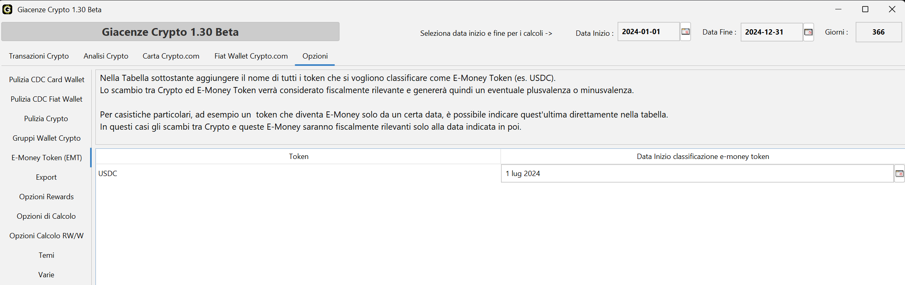
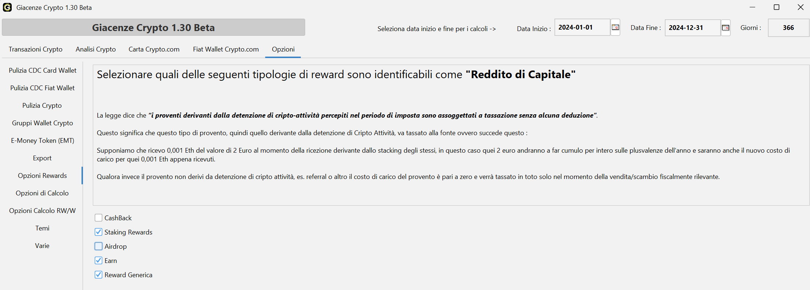
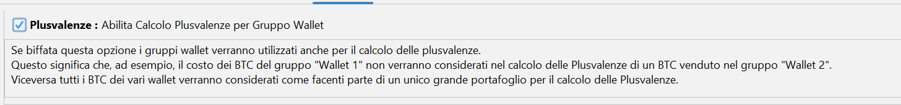
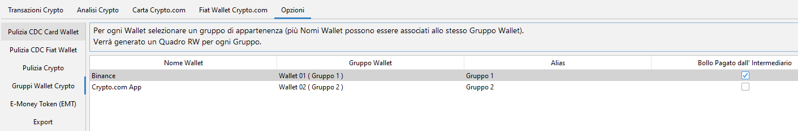
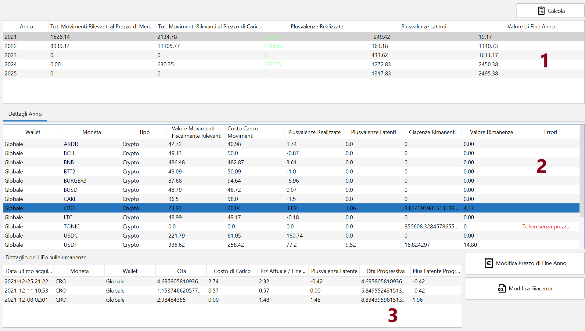

# Calcolo delle plusvalenze e opzioni

- [Introduzione e normativa di riferimento](#introduzione-e-normativa-di-riferimento)
- [Definizione di plusvalenza](#definizione-di-plusvalenza)
- [Casi fiscalmente rilevanti](#casi-fiscalmente-rilevanti)
- [Metodo di valutazione: LIFO](#metodo-di-valutazione-lifo)
- [Esempi di calcolo con metodo LIFO](#esempi-di-calcolo-con-metodo-lifo)
- [Plusvalenze globali o per gruppo wallet](#plusvalenze-globali-o-per-gruppo-wallet)
- [Situazione ante Legge di bilancio 2023](#situazione-ante-legge-di-bilancio-2023)
- [Funzione "RT & Analisi P&L"](#funzione-rt--analisi-pl)
- [Note importanti](#note-importanti)
- [Bibliografia](#bibliografia)

## Introduzione e normativa di riferimento {#introduzione-e-normativa-di-riferimento}

Il calcolo delle plusvalenze derivanti da operazioni su criptovalute in Italia è regolato
principalmente dal **Testo Unico delle Imposte sui Redditi (TUIR)**, in particolare dagli articoli 67 e
68, che trattano i redditi diversi.

Le plusvalenze generate dalla compravendita di cripto-attività sono soggette a tassazione, ma fino al
2022 venivano equiparate a valute estere (per approfondimenti si rimanda alla
[circolare 30/E dell'Agenzia delle Entrate](https://www.agenziaentrate.gov.it/portale/documents/20143/5589638/Circolare+criptoattivita+del+27+ottobre+2023.pdf)
del 27/10/2023).

Con l'entrata in vigore della
[Legge di Bilancio 2023](https://www.gazzettaufficiale.it/atto/serie_generale/caricaDettaglioAtto/originario?atto.dataPubblicazioneGazzetta=2022-12-29&atto.codiceRedazionale=22G00211&elenco30giorni=false)
(commi dal 126 al 146) è stato introdotto un quadro normativo più chiaro, che tra le altre cose include:

- la definizione di **cripto-attività**, ovvero "rappresentazione digitale di valore o di diritti che
  possono essere trasferiti e memorizzati elettronicamente, utilizzando la tecnologia di registro
  distribuito o una tecnologia analoga";
- la definizione di cosa concorre alla realizzazione delle plusvalenze, ovvero i proventi realizzati
  mediante **rimborso**, **cessione a titolo oneroso**, **permuta** o **detenzione**;
- la **non rilevanza fiscale** degli scambi tra cripto-attività aventi eguali caratteristiche e funzioni;
- una **soglia di esenzione annuale** per le plusvalenze inferiori a 2.000 €.

Successivamente, con la
[Legge di Bilancio 2025](https://www.normattiva.it/atto/caricaDettaglioAtto?atto.dataPubblicazioneGazzetta=2024-12-31&atto.codiceRedazionale=24G00229&atto.articolo.numero=0&atto.articolo.sottoArticolo=1&atto.articolo.sottoArticolo1=0&qId=8adc1507-825e-48dc-8e45-bf015a494974)
(commi dal 23 al 29), la soglia dei 2.000 € è stata abolita a partire dall'anno fiscale **2025**.

## Definizione di plusvalenza {#definizione-di-plusvalenza}

La plusvalenza è la differenza positiva tra:

- il prezzo di vendita delle cripto-attività;
- il prezzo di acquisto, ovvero il valore di carico.

Se la differenza è negativa si parla di **minusvalenza**.

> **NB** — nel programma le minusvalenze si trovano molto spesso sotto la voce *Plusvalenze*, ma con
> importo negativo.

Formula generale:

**Plusvalenza = prezzo di vendita − prezzo di acquisto**

## Casi fiscalmente rilevanti {#casi-fiscalmente-rilevanti}

Facendo riferimento alla normativa, sono considerate fiscalmente rilevanti le operazioni che comportano:

### Conversione di cripto-attività in valuta fiat {#conversione-di-cripto-attività-in-valuta-fiat}

Cessione a titolo oneroso: è sempre rilevante.

### Scambio tra cripto-attività aventi diverse caratteristiche e funzioni (permuta) {#scambio-tra-cripto-attività-aventi-diverse-caratteristiche-e-funzioni-permuta}

Come si evince dalla circolare 30/E dell'Agenzia delle Entrate, per ora gli scambi rilevanti sono quelli
tra queste tre categorie disomogenee: **E-Money Token**, **NFT** e **criptovalute "generiche"**.

Sono quindi **fiscalmente rilevanti**:

- E-Money ↔ NFT
- E-Money ↔ crypto "generiche"
- NFT ↔ crypto "generiche"

**Non** sono invece rilevanti gli scambi tra cripto-attività dello stesso tipo:

- NFT ↔ NFT
- E-Money ↔ E-Money
- crypto "generiche" ↔ crypto "generiche"

Il problema sta nella definizione di E-Money Token. Nella circolare 30/E l'Agenzia delle Entrate fa
riferimento al MiCA e divide le stablecoin in due categorie, **E-Money Token (EMT)** e
**Asset-Referenced Token (ART)**, dove:

- per **e-money token** si intende un tipo di cripto-attività che mira a mantenere un valore stabile
  facendo riferimento al valore di una valuta ufficiale;
- per **asset-referenced token** si intende un tipo di cripto-attività che non è un token di moneta
  elettronica e che mira a mantenere un valore stabile facendo riferimento a un altro valore o diritto,
  o a una combinazione dei due, comprese una o più valute ufficiali.

Leggendo la definizione pare che le stablecoin legate a moneta fiat siano classificabili come EMT, ma è
anche vero che per essere EMT secondo la normativa MiCA una cripto-attività deve rispettare determinati
requisiti e ottenere apposite licenze (anche per essere ART autorizzate a operare in UE servono
determinati requisiti). A questo punto ci sono due scuole di pensiero.

**Solo le stablecoin MiCA compliant sono EMT a tutti gli effetti** (ad esempio USDC a partire dal
1° luglio 2024). Opinioni a favore:
[CryptoBooks](https://cryptobooks.tax/it/blog/pagare-meno-tasse-crypto-2024),
[Koinly](https://koinly.io/guides/guida-fiscale-italia/),
[Blockpit.io](https://www.blockpit.io/tax-guides/guida-fiscale-sulle-criptovalute-italia).

**Quasi tutte le stablecoin legate a moneta fiat sono da considerarsi EMT**, con alcune eccezioni.
Opinioni a favore:
[Studio Tibaldo](https://www.studiotibaldo.com/stable-coin-tassazione/),
[FAQ Cripto Attività FinanzaOnline](https://forum.finanzaonline.com/threads/faq-tassazione-cripto-attivita.2058741/),
[Studio Teruzzi](https://www.studioteruzzi.it/cripto-quando-si-tassa-la-plusvalenza-nel-quadro-rt/),
[Agendadigitale.eu](https://www.agendadigitale.eu/mercati-digitali/criptovalute-nella-dichiarazione-dei-redditi-2024-linee-guida-per-non-sbagliare/),
[The Crypto Gateway](https://thecryptogateway.it/tasse-su-criptovalute-2023/),
[Filippo Angeloni](https://youtu.be/pDRzvLjlgB0?si=MR5GU2aWmftNWXUK).

Proprio per questo il programma lascia scegliere all'utente **cosa** considerare EMT e **da quando**. Le
impostazioni si trovano in **Opzioni – E-Money Token**.

Sopra, un esempio di configurazione in cui si ritiene che solo USDC, e solo a partire dalla data in cui
ha acquisito la licenza (1° luglio 2024), sia da considerarsi EMT.

> **NB** — di default la tabella è **vuota**: va quindi compilata autonomamente.

### Acquisto di beni o servizi utilizzando cripto-attività {#acquisto-di-beni-o-servizi-utilizzando-cripto-attività}

Cessione a titolo oneroso.

> **NB** — il programma considera le commissioni applicate dagli exchange o in DeFi alla stregua
> dell'acquisto di un servizio: ne viene quindi calcolata la plusvalenza.

### Rimborso {#rimborso}

Nel contesto delle cripto-attività il termine "rimborso" si riferisce alla situazione in cui il titolare
riceve un pagamento o una restituzione di valore a fronte della cessazione o liquidazione di quella
specifica attività. Può avvenire, ad esempio:

- **stablecoin o token con valore garantito**: alcune cripto-attività garantite da riserve (USDC, USDT)
  possono prevedere la restituzione del token in cambio della somma equivalente nella valuta sottostante;
- **liquidazione di un fondo o progetto**: i partecipanti possono ricevere un rimborso proporzionale del
  valore residuo delle attività.

I **prestiti** (borrowing) sono gestiti dal programma tramite le apposite voci di classificazione dei
depositi e dei prelievi — ricezione dei fondi, messa a collaterale, sblocco del collaterale e
liquidazione forzata: vedi
[Classificazione dei movimenti](classificazioni-movimenti.html). Restano invece **non gestiti** i
derivati e i futures, che seguono altre regole.

### Proventi da detenzione {#proventi-da-detenzione}

I guadagni derivanti da strumenti come **staking**, **earn**, interessi su prestiti di criptovalute e
altre forme di reddito passivo sono considerati fiscalmente rilevanti: il provento è tassato come reddito
diverso al momento della percezione. Alcune precisazioni:

- gli **airdrop**, a differenza di staking ed earn, non sempre sono classificabili come proventi da
  detenzione: molto spesso vengono erogati a fronte di azioni effettuate e non per il semplice fatto di
  detenere determinati asset;
- il **cashback** si può vedere in più modi:
  - **è** un provento da detenzione, in quanto spesso richiede il blocco di fondi per poterne usufruire;
  - **non è** un provento da detenzione, perché non è il mero possesso di un asset a determinare la
    ricompensa, che scaturisce invece dall'acquisto di un bene o servizio. In questo secondo caso ci sono
    due ulteriori possibilità: vedere il cashback come una sorta di sconto, e quindi caricare il provento
    con costo di carico pari al prezzo di mercato, oppure caricarlo a costo zero. L'ipotesi dello sconto
    era stata prospettata dall'Agenzia delle Entrate nell'
    [interpello 338/2021](https://www.agenziaentrate.gov.it/portale/documents/20143/0/Risposta_338_12.05.2021.pdf/37afcc06-0ed0-9e4d-f05d-6be6f2df8adc),
    che però riguardava il cashback in euro: non è detto si possa applicare anche alle cripto-attività.

Viste le molteplici possibilità, in **Opzioni – Opzioni Rewards** è possibile indicare cosa considerare
o meno provento da detenzione in base alle proprie valutazioni.

Nella tabella qui sopra, ad esempio, si è scelto che airdrop e cashback non sono da considerarsi proventi
da detenzione e verranno quindi caricati a costo di carico zero.

> **NB** — per il cashback non è attualmente prevista l'opzione di caricarlo a prezzo di mercato senza
> che questo produca plusvalenza.

## Metodo di valutazione: LIFO {#metodo-di-valutazione-lifo}

Il metodo **LIFO (Last In, First Out)** è utilizzato per determinare il prezzo di acquisto delle
criptovalute vendute: si considera venduta per prima l'ultima unità di criptovaluta acquistata.

## Esempi di calcolo con metodo LIFO {#esempi-di-calcolo-con-metodo-lifo}

Gli esempi che seguono sono in ordine di complessità e cercano di coprire un po' tutte le casistiche.

### Esempio 1 – Compravendita BTC {#esempio-1--compravendita-btc}

1. Acquisto di 1 BTC a **20.000 €** il 1° gennaio.
2. Acquisto di 1 BTC a **25.000 €** il 1° marzo.
3. Vendita di 1 BTC a **30.000 €** il 1° maggio.

Al punto **3** si considera venduto il BTC acquistato il 1° marzo a 25.000 €:

*Plusvalenza = 30.000 € − 25.000 € = **5.000 €***

### Esempio 2 – Compravendita BTC con frazioni di vendita {#esempio-2--compravendita-btc-con-frazioni-di-vendita}

1. Acquisto di 1 BTC a **20.000 €** il 1° gennaio.
2. Acquisto di 1 BTC a **40.000 €** il 1° marzo.
3. Vendita di 1,5 BTC a **60.000 €** il 1° maggio.

Al punto **3** il costo di carico di 1,5 BTC è dato dal costo di 1 BTC del 1° marzo più quello di 0,5 BTC
del 1° gennaio: 40.000 € + 10.000 € = 50.000 €.

*Plusvalenza = 60.000 € − 50.000 € = **10.000 €***

### Esempio 3 – Scambio tra cripto omogenee e successiva vendita {#esempio-3--scambio-tra-cripto-omogenee-e-successiva-vendita}

1. Acquisto di 1 BTC a **20.000 €** il 1° gennaio.
2. Vendita di 1 BTC **per 10 ETH** il 1° marzo.
3. Vendita di 1 ETH a **3.000 €** il 1° maggio.

Al punto **2** termina la detenzione di 1 BTC con costo di carico 20.000 € e inizia quella di 10 ETH, che
si portano dietro lo stesso costo di carico: il costo unitario per ETH è quindi 2.000 €.

Al punto **3**: *Plusvalenza = 3.000 € − 2.000 € = **1.000 €***

### Esempio 4 – Successivi scambi e vendite di cripto omogenee {#esempio-4--successivi-scambi-e-vendite-di-cripto-omogenee}

1. Acquisto di 1 BTC a **20.000 €** il 1° gennaio.
2. Acquisto di 1 BTC a **30.000 €** il 1° marzo.
3. Vendita di 2 BTC **per 10 ETH** il 1° aprile.
4. Acquisto di 1 ETH per **3.000 €** il 1° maggio.
5. Vendita di 2 ETH a **9.000 €** il 1° giugno.

Al punto **3** il costo di carico dei 10 ETH è 30.000 € + 20.000 € = 50.000 €, quindi 5.000 € per ETH.

Al punto **5** il costo di carico dei 2 ETH venduti è 3.000 € (ETH del 1° maggio) + 5.000 € (uno degli
ETH del 1° aprile) = 8.000 €.

*Plusvalenza = 9.000 € − 8.000 € = **1.000 €***

> **NB** — non tutti i software si comportano allo stesso modo in questo caso particolare. La maggioranza,
> **Giacenze Crypto** compreso, applica il sistema appena descritto; altri potrebbero invece caricare al
> punto 3 cinque ETH a 6.000 € (30.000/5) e altri cinque a 4.000 € (20.000/5), ottenendo — a seconda
> dell'ordine nello stack — una plusvalenza di 0 € oppure di 2.000 €.

### Esempio 5 – Compravendita NFT {#esempio-5--compravendita-nft}

1. Acquisto di 1 BTC a **20.000 €** il 1° gennaio.
2. Acquisto di 1 BTC a **30.000 €** il 1° marzo.
3. Vendita di 0,5 BTC **per 1 NFT** il 1° aprile, al controvalore di **20.000 €**.
4. Vendita di quell'NFT a **18.000 €** il 1° giugno.

Al punto **3** si calcola una prima plusvalenza per i 0,5 BTC ceduti (scambio tra cripto-attività con
diverse caratteristiche e funzioni): 20.000 € − 15.000 € = **5.000 €**. Il valore della transazione
diventa inoltre il costo di carico dell'NFT, ovvero 20.000 €.

Al punto **4**: 18.000 € − 20.000 € = **−2.000 €**.

La plusvalenza totale di fine anno è quindi **3.000 €**.

### Esempio 6 – Proventi da staking {#esempio-6--proventi-da-staking}

1. Acquisto di 10 ETH a **30.000 €** il 1° gennaio.
2. Ricezione di 0,1 ETH come provento da staking, con prezzo pari a **300 €**, il 1° marzo.
3. Vendita di 0,1 ETH a **200 €** il 1° giugno.

Al punto **2** si calcola una plusvalenza immediata di **300 €** (provento da detenzione); quei 300 €
diventano il nuovo costo di carico dei 0,1 ETH ricevuti.

Al punto **3**: 200 € − 300 € = **−100 €**.

La plusvalenza totale di fine anno è quindi **200 €**.

## Plusvalenze globali o per gruppo wallet {#plusvalenze-globali-o-per-gruppo-wallet}

### Calcoli globali {#calcoli-globali}

Generalmente la plusvalenza viene calcolata considerando tutti i wallet come un'unica entità. Ad esempio:

- 01/01 compro 1 BTC sul **wallet 1** per 10.000 €;
- 01/02 compro 1 BTC sul **wallet 2** per 20.000 €;
- 01/03 vendo 1 BTC sul **wallet 1** per 30.000 €.

Il LIFO si applica come se tutto fosse avvenuto sullo stesso wallet: la plusvalenza è quindi di 10.000 €.

### Calcoli per gruppo wallet {#calcoli-per-gruppo-wallet}

Il programma prevede anche la possibilità di applicare il LIFO **per gruppo di wallet**. Servono due
operazioni.

Abilitare in **Opzioni – Opzioni di calcolo** la relativa spunta:

In **Opzioni – Gruppi Wallet Crypto** spostare i vari wallet nel gruppo desiderato:

Supponendo di mettere Binance nel **Gruppo 1** e Crypto.com nel **Gruppo 2**, l'esempio precedente
diventa:

- 01/01 compro 1 BTC su Binance (**Gruppo 1**) per 10.000 €;
- 01/02 compro 1 BTC su Crypto.com (**Gruppo 2**) per 20.000 €;
- 01/03 vendo 1 BTC su Binance (**Gruppo 1**) per 30.000 €.

In questo caso la plusvalenza calcolata è di 20.000 € (30.000 € − 10.000 €), perché i wallet appartenenti
al Gruppo 1 possono vendere solo cripto appartenute allo stesso gruppo.

### Trasferimenti tra wallet di proprietà {#trasferimenti-tra-wallet-di-proprietà}

**Con calcolo globale** i trasferimenti tra wallet di proprietà non vengono presi in considerazione: sono
completamente trasparenti.

**Con calcolo per gruppo wallet** il costo di carico della moneta uscita dal wallet di origine viene
trasferito su quello di destinazione (un po' come succede con gli scambi non rilevanti). Esempio:

- 01/01 compro 1 BTC sul **Gruppo 2** per 10.000 €;
- 01/02 compro 1 BTC sul **Gruppo 1** per 20.000 €;
- 01/03 sposto 1 BTC dal **Gruppo 2** al **Gruppo 1**;
- 01/04 vendo 1 BTC sul **Gruppo 1** per 30.000 €.

Il 01/03 viene caricato 1 BTC sul Gruppo 1 con costo di carico pari all'acquisto del 01/01, ovvero
10.000 €: la posizione viene chiusa sul Gruppo 2 e aperta sul Gruppo 1, esattamente come avviene per gli
scambi non rilevanti. Il 01/04 si realizza quindi una plusvalenza di **20.000 €**.

## Situazione ante Legge di bilancio 2023 {#situazione-ante-legge-di-bilancio-2023}

### Scambi cripto-cripto {#scambi-cripto-cripto}

Fino al 31/12/2022 le criptovalute erano equiparate a valute estere. Secondo il comma 1-ter
dell'articolo 67 del TUIR:

> *Le plusvalenze derivanti dalla cessione a titolo oneroso di valute estere rivenienti da depositi e
> conti correnti concorrono a formare il reddito a condizione che nel periodo d'imposta la giacenza dei
> depositi e conti correnti complessivamente intrattenuti dal contribuente, calcolata secondo il cambio
> vigente all'inizio del periodo di riferimento, sia superiore a cento milioni di lire (51.645,69 euro)
> per almeno sette giorni lavorativi continui.*

La [circolare 30/E](https://www.agenziaentrate.gov.it/portale/documents/20143/5589638/Circolare+criptoattivita+del+27+ottobre+2023.pdf)
aggiunge che:

> *Applicando tali principi alle cripto-valute, consegue che cessioni a "termine" di tali attività
> rilevano sempre fiscalmente, mentre le cessioni a "pronti" generalmente non danno origine a redditi
> imponibili mancando la finalità speculativa, salva l'ipotesi in cui la valuta ceduta derivi da prelievi
> da wallet, per i quali la giacenza media superi un controvalore di euro 51.645,69 per almeno sette
> giorni lavorativi continui nel periodo d'imposta.*

e precisa inoltre che *"il trasferimento da una tipologia di wallet ad un'altra di proprietà del medesimo
contribuente non costituisce una fattispecie fiscalmente rilevante"*, indicando anche il LIFO come metodo
di calcolo.

**Chiarimenti operativi:**

- la **cessione a pronti** corrisponde a uno scambio spot;
- la **cessione a termine** si riferisce, ad esempio, a operazioni con futures e derivati.

Questo significa che la tassazione sulle plusvalenze derivanti dallo scambio o dalla vendita a pronti di
criptovalute era applicata **solo se** la giacenza media, valorizzata al prezzo di inizio anno, superava
la soglia di 51.645,69 € per sette giorni consecutivi nell'arco dell'anno fiscale. Gli scambi sotto
soglia generavano comunque plusvalenza, che semplicemente non concorreva alla formazione del reddito
imponibile.

> **NB** — se si hanno movimentazioni antecedenti al 2023 è necessario verificare la relativa opzione in
> **Opzioni – Opzioni di calcolo**.

Questo permette di adeguare il comportamento del software alle regole appena descritte e di portarsi
dietro i costi di carico corretti negli anni successivi. **Dalla versione 1.0.31 l'opzione è attiva per
impostazione predefinita.**

L'opzione resta comunque disattivabile perché in
[questo documento](https://blog.moneyviz.it/criptovalute-superamento-soglia-51-64569-e-guida/593/) c'è un
passaggio non chiaro, ovvero *"questo superamento* (della soglia dei 51K) *fa diventare fiscalmente
rilevante tutti gli altri scambi effettuati in tutti i wallet del contribuente nell'anno fiscale di
riferimento"*. Dalle ricerche svolte sembrerebbe invece che diventino rilevanti i guadagni derivanti da
questi scambi, non gli scambi stessi. Chi ritiene che gli scambi cripto-cripto non vadano considerati
rilevanti neanche ante Legge di bilancio può quindi togliere la spunta.

### Staking e altre rendite passive {#staking-e-altre-rendite-passive}

Sui proventi da staking l'Agenzia delle Entrate si esprime così:

> *Dette remunerazioni, se percepite da soggetti residenti senza l'intervento di una società italiana che
> ha applicato la ritenuta a titolo d'acconto, devono essere indicate in dichiarazione nella medesima
> Sezione I-A "Redditi di capitale" del Quadro RL del Modello Redditi 2023.*

In sostanza generavano reddito esattamente come succede ora, ma andavano inserite in un quadro diverso.
L'Agenzia non specifica però se anche le altre forme di rendita passiva debbano essere trattate allo
stesso modo.

Nella confusione precedente all'avvento della nuova normativa molti preferivano caricare questo tipo di
provento a costo di carico zero, valutando l'eventuale tassazione in fase di vendita. Per seguire questa
interpretazione il programma prevede la seguente opzione, sempre in **Opzioni – Opzioni di calcolo**:

Se l'opzione non viene attivata, il programma applica anche agli anni precedenti le impostazioni valide
dal 2023, seguendo quindi le regole impostate in **Opzioni – Opzioni Rewards**.

## Funzione "RT & Analisi P&L" {#funzione-rt--analisi-pl}

La funzione, presente nella sezione **Analisi Crypto**, permette di vedere le plusvalenze realizzate e
quelle latenti nei vari anni, e fornisce un'analisi token per token della composizione delle plusvalenze
latenti.

**Plusvalenza latente e realizzata.** La plusvalenza **latente** indica un incremento di valore non
ancora realizzato attraverso una vendita o una cessione: se compro 1 BTC a inizio anno per 10.000 € e a
fine anno vale 100.000 €, ho una plusvalenza latente di 90.000 €. Non è tassabile: è solo un'indicazione
di quanto si potrebbe realizzare vendendo in quel momento. La plusvalenza diventa **realizzata** nel
momento in cui la vendita genera un evento fiscalmente rilevante.

Premendo **Calcola** il programma analizza le plusvalenze dei vari anni. Sono presenti tre tabelle.

**Tabella 1** — per ogni anno vengono indicati la plusvalenza realizzata, quella latente e il totale del
valore di tutti i wallet al 31/12. Si ricorda che *plusvalenza latente totale = valore di fine anno −
totale dei costi di carico*. Per quanto riguarda il valore di fine anno, tenere presente che non tutti i
token potrebbero essere stati valorizzati: guardare la Tabella 2 per il dettaglio e assegnare un prezzo
alla moneta.

**Tabella 2** — selezionando una riga della Tabella 1 compare la composizione dei wallet token per token
per l'anno selezionato (e, se è attivo il calcolo per gruppo wallet, gruppo per gruppo). Anche qui si
vedono plusvalenze e minusvalenze, realizzate e latenti, e le rimanenze di fine anno. Nella colonna
**Errori** vengono segnalati i token a cui il programma non è riuscito ad assegnare un prezzo: per
sistemare l'anomalia selezionare la riga e premere **Modifica prezzo di fine anno**, inserendo il valore
in euro dell'intero ammontare dei token posseduti (vanno corretti i token con segnalazione di errore, non
quelli valorizzati a 0,00). Nella stessa colonna vengono segnalate anche le **giacenze negative**,
correggibili con **Modifica Giacenza**: si viene reindirizzati alla funzione *Giacenze a Data*, dove è
possibile creare un movimento correttivo.

**Tabella 3** — viene popolata selezionando un token dalla Tabella 2 e mostra la composizione dello stack
LIFO per quel token fino a fine anno (o, se è selezionato l'anno corrente, fino alla data attuale).
Supponendo questa situazione:

- 2023-01-01 compro 100 CRO per 10 €;
- 2023-02-01 compro 50 CRO per 15 €;
- 2023-03-01 compro 200 CRO per 220 €;
- a fine anno 1 CRO vale 1 €.

lo stack LIFO mostrato a fine anno sarà:

| Data ultimo acquisto | Moneta | Wallet | Qtà | Costo di carico totale | Prezzo di fine anno | Plusvalenza latente | Qtà progressiva | Plusvalenza latente progressiva |
|---|---|---|---|---|---|---|---|---|
| 2023-03-01 | CRO | Globale | 200 | 220 | 200 | −20 | 200 | −20 |
| 2023-02-01 | CRO | Globale | 50 | 15 | 50 | 35 | 250 | 15 |
| 2023-01-01 | CRO | Globale | 100 | 10 | 100 | 90 | 350 | 105 |

La tabella rappresenta la totalità dei token posseduti, in ordine, a partire dall'ultimo entrato: è
esattamente l'ordine che il programma utilizzerà per il calcolo delle plusvalenze in caso di vendita.
Dall'esempio si capisce che vendendo tutti i 350 token si genererebbe una plusvalenza di 105 €, mentre
vendendone soltanto 200 si genererebbe una minusvalenza di 20 € — un'informazione utile per un'eventuale
pianificazione fiscale.

## Note importanti {#note-importanti}

Affinché i calcoli risultino corretti è necessario:

1. correggere tutti gli errori che si presentano nella schermata principale del programma;
2. caricare tutte le movimentazioni cripto di tutti i wallet posseduti **fin dal primo possesso**: non è
   sufficiente caricare i dati del solo anno fiscale di interesse;
3. controllare le giacenze di fine anno con gli screenshot degli exchange e sistemare le anomalie;
4. leggere la documentazione e selezionare le opzioni adeguate secondo la propria interpretazione e la
   propria propensione al rischio.

Si ricorda inoltre che:

1. non sono gestiti derivati, futures e simili, perché seguono altre regole;
2. quanto scritto in questa documentazione, così come il funzionamento del programma, è frutto di
   ricerche e di un'interpretazione personale, quindi soggetto a possibili errori.

## Bibliografia {#bibliografia}

**Leggi e circolari**

- [Circolare 30/E dell'Agenzia delle Entrate](https://www.agenziaentrate.gov.it/portale/documents/20143/5589638/Circolare+criptoattivita+del+27+ottobre+2023.pdf)
- [Legge di Bilancio 2023](https://www.gazzettaufficiale.it/atto/serie_generale/caricaDettaglioAtto/originario?atto.dataPubblicazioneGazzetta=2022-12-29&atto.codiceRedazionale=22G00211&elenco30giorni=false)
- [Legge di Bilancio 2025](https://www.normattiva.it/atto/caricaDettaglioAtto?atto.dataPubblicazioneGazzetta=2024-12-31&atto.codiceRedazionale=24G00229&atto.articolo.numero=0&atto.articolo.sottoArticolo=1&atto.articolo.sottoArticolo1=0&qId=8adc1507-825e-48dc-8e45-bf015a494974)

**Interpretazioni omnicomprensive**

- [FAQ Cripto Attività FinanzaOnline](https://forum.finanzaonline.com/threads/faq-tassazione-cripto-attivita.2058741/)

**Interpretazioni specifiche sulle stablecoin (questione E-Money Token)**

- [CryptoBooks](https://cryptobooks.tax/it/blog/pagare-meno-tasse-crypto-2024)
- [Koinly](https://koinly.io/guides/guida-fiscale-italia/)
- [Blockpit.io](https://www.blockpit.io/tax-guides/guida-fiscale-sulle-criptovalute-italia)
- [Studio Tibaldo](https://www.studiotibaldo.com/stable-coin-tassazione/)
- [Studio Teruzzi](https://www.studioteruzzi.it/cripto-quando-si-tassa-la-plusvalenza-nel-quadro-rt/)
- [Agendadigitale.eu](https://www.agendadigitale.eu/mercati-digitali/criptovalute-nella-dichiarazione-dei-redditi-2024-linee-guida-per-non-sbagliare/)
- [The Crypto Gateway](https://thecryptogateway.it/tasse-su-criptovalute-2023/)
- [Filippo Angeloni](https://youtu.be/pDRzvLjlgB0?si=MR5GU2aWmftNWXUK)

[Torna all'indice della documentazione](./)
