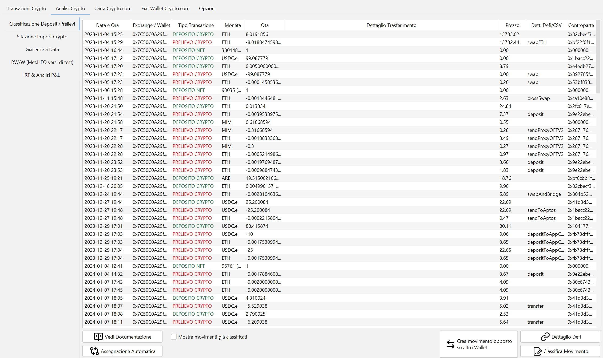
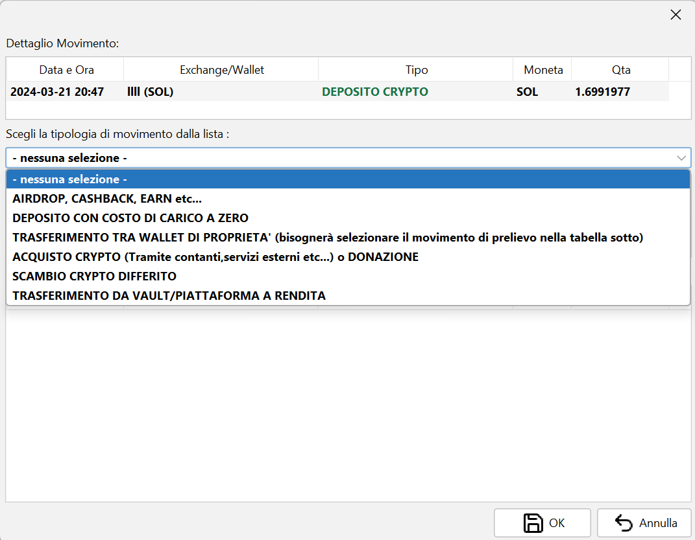
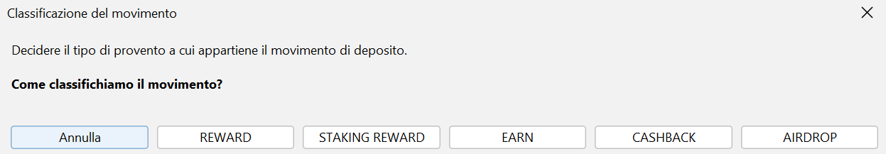
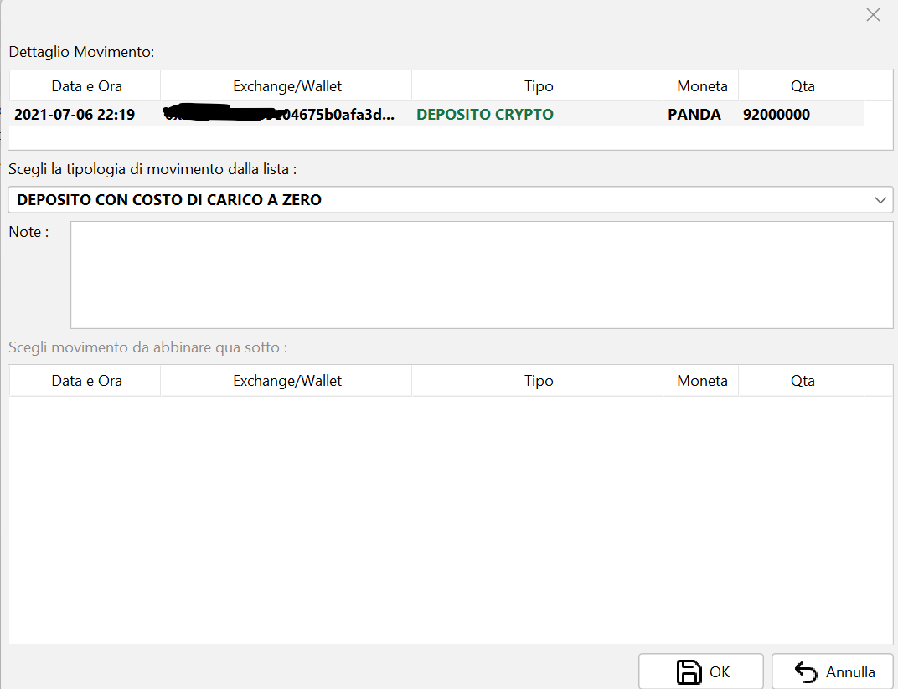
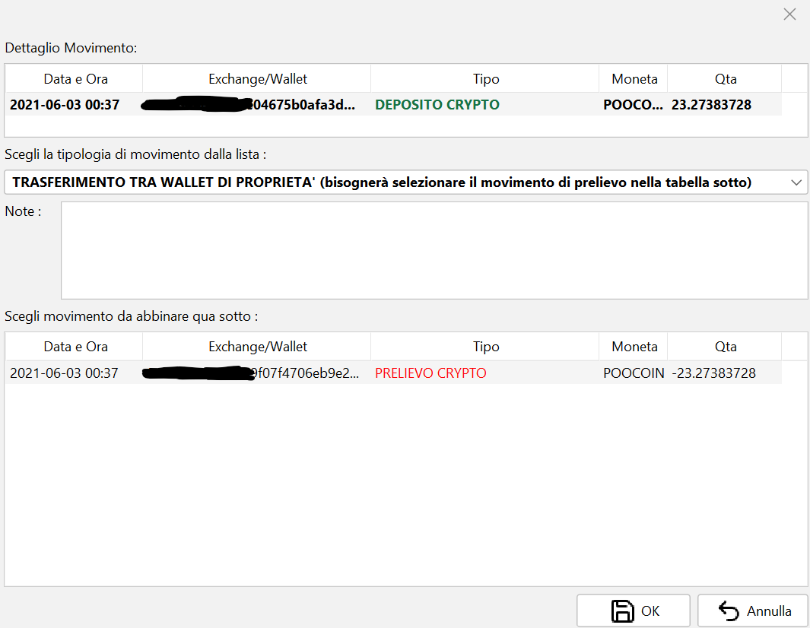
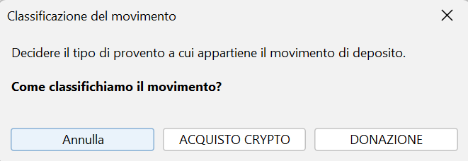
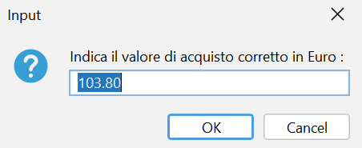
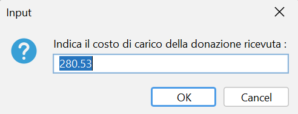
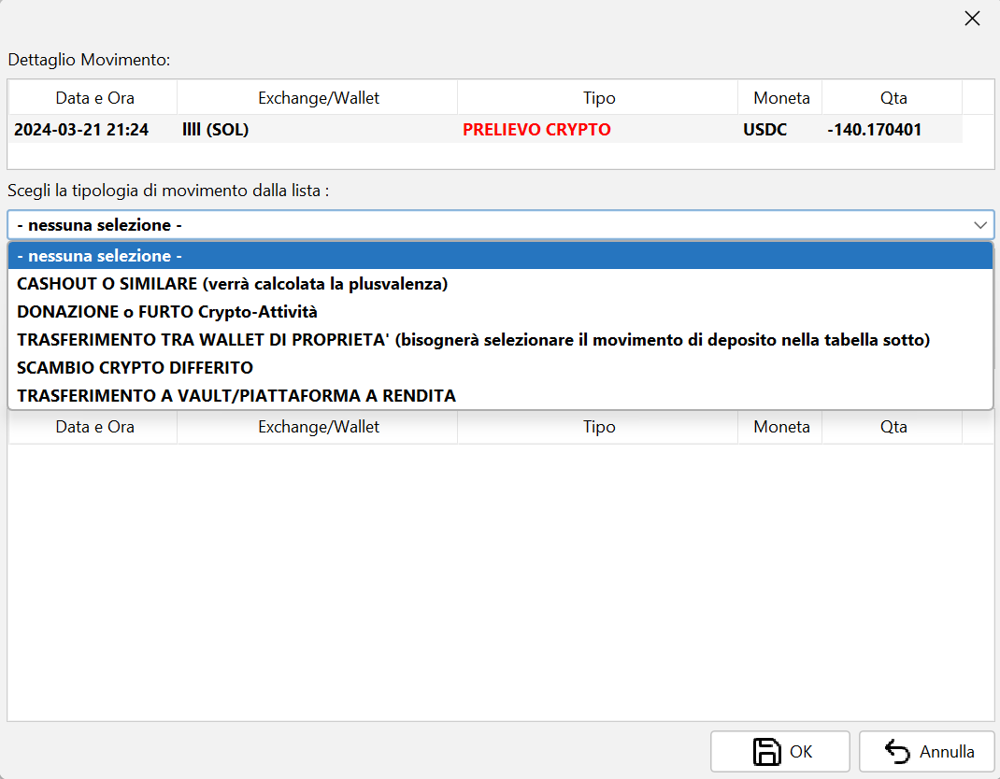
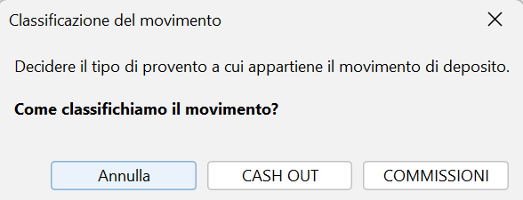

# Classificazione dei depositi e dei prelievi

- [Introduzione](#introduzione)
- [Panoramica delle opzioni](#panoramica-delle-opzioni)
- [Classificazione dei movimenti di DEPOSITO](#classificazione-dei-movimenti-di-deposito)
- [Classificazione dei movimenti di PRELIEVO](#classificazione-dei-movimenti-di-prelievo)

## Introduzione {#introduzione}

Affinché il calcolo delle plusvalenze avvenga in maniera corretta è **necessario** che ogni movimento di
deposito e prelievo venga classificato correttamente.

I movimenti di deposito o prelievo possono infatti portare o meno alla generazione di
plusvalenze/minusvalenze a seconda della loro tipologia.

*Esempio*: un movimento di prelievo potrebbe derivare da un trasferimento su un altro wallet di
proprietà, oppure essere un cashout. Nel primo caso non vi è alcuna plusvalenza, nel secondo la
plusvalenza viene calcolata.

**NB** — dalla versione 1.0.29 del programma tutti i **movimenti non classificati** manualmente vengono
conteggiati nel modo seguente:

- **movimenti di prelievo**: vengono considerati alla stregua di un **cashout**;
- **movimenti di deposito**: vengono considerati come movimenti a **costo di carico zero**.

Prima della versione 1.0.29 i movimenti non classificati non venivano invece presi in considerazione in
alcun modo nei calcoli delle plusvalenze.

Nelle sezioni successive si analizzano tutte le possibilità offerte dal programma per la classificazione
dei movimenti.

## Panoramica delle opzioni {#panoramica-delle-opzioni}

La classificazione dei depositi e dei prelievi si trova nella sezione **Analisi Crypto –
Classificazione Depositi/Prelievi**. Una volta entrati nella funzione ci si troverà davanti a una
schermata di questo tipo:

In tabella vengono mostrati tutti i movimenti di deposito e prelievo ancora da classificare; per vederli
tutti è sufficiente spuntare l'opzione in basso *Mostra movimenti già classificati*.

Nella parte bassa si trovano i seguenti tasti funzione:

- **Vedi Documentazione** — apre questa documentazione.
- **Assegnazione Automatica** — il programma cerca in autonomia gli scambi relativi a wallet di
  proprietà e li associa; assicurarsi di aver prima censito tutti i wallet.
- **Crea Movimento Opposto su altro wallet** — utile quando si vogliono inserire i movimenti
  manualmente.
- **Dettaglio DeFi** — in caso di transazione in DeFi apre l'explorer corrispondente per analizzare la
  transazione più nel dettaglio (funziona solo per le blockchain supportate).
- **Identifica come SCAM** — marca il token del movimento selezionato come token spazzatura, così da
  escluderlo dai calcoli e dai prospetti; funziona anche su più righe selezionate insieme.
- **Identificazione SCAM automatica** — verifica tramite GoPlusLabs i token che ne hanno i requisiti
  (solo depositi/prelievi non classificati, non valorizzati, con indirizzo e rete noti) e propone quelli
  risultati sospetti.
- **Duplica movimento** — crea una copia del movimento selezionato, utile quando una sola riga
  importata rappresenta in realtà due operazioni.
- **Classifica Movimento** — serve per la classificazione manuale del movimento selezionato.

## Classificazione dei movimenti di DEPOSITO {#classificazione-dei-movimenti-di-deposito}

Selezionando un movimento di deposito le opzioni sono quelle visualizzate di seguito:

### Opzione 1 – AIRDROP, CASHBACK, EARN, ecc. {#opzione-1--airdrop-cashback-earn-ecc}

Scegliendo la prima opzione il programma propone la maschera seguente, in cui viene chiesto nello
specifico il tipo di movimento da assegnare.

Questo serve perché, a seconda del tipo di movimento scelto, si potrebbe generare o meno una plusvalenza
immediata. Le opzioni personalizzabili a riguardo si trovano nella sezione **Opzioni – Opzioni Rewards**.

### Opzione 2 – DEPOSITO CON COSTO DI CARICO A ZERO {#opzione-2--deposito-con-costo-di-carico-a-zero}

È una categoria generica con cui si segnala al programma di trattare il movimento di deposito con costo
di carico zero (alla stregua di taluni airdrop). Nel campo note si può specificare la motivazione.

### Opzione 3 – TRASFERIMENTO TRA WALLET DI PROPRIETÀ {#opzione-3--trasferimento-tra-wallet-di-proprietà}

Scegliendo questa opzione, nella parte bassa il programma propone tutti i movimenti di prelievo
compatibili con un possibile trasferimento tra wallet.

Selezionando il prelievo desiderato e premendo **OK** i due movimenti vengono associati. Eventuali
differenze di quantità vengono convertite in commissioni.

*Esempio*:

- movimento di prelievo di 1,00 USDT;
- movimento di deposito di 0,99 USDT.

Una volta associati si avranno un prelievo e un deposito di 0,99 USDT e un movimento classificato come
commissione di 0,01 USDT.

A seconda dell'opzione scelta in **Opzioni – Opzioni di Calcolo**, il trasferimento risulterà totalmente
irrilevante ai fini del calcolo della plusvalenza, oppure servirà a spostare il costo di carico dal
movimento di prelievo a quello di deposito.

### Opzione 4 – ACQUISTO CRYPTO o DONAZIONE {#opzione-4--acquisto-crypto-o-donazione}

Scegliendo questa opzione il programma propone la maschera seguente, in cui viene chiesto nello
specifico il tipo di movimento da assegnare.

Scegliendo **ACQUISTO CRYPTO** si presuppone che il deposito sia in realtà un acquisto effettuato, ad
esempio, da una piattaforma esterna come MoonPay o analoghe. Il programma chiede quindi di inserire
l'importo in euro usato per l'acquisto; è opportuno indicarlo **al netto** delle commissioni pagate per
il servizio.

Scegliendo **DONAZIONE** il programma propone una maschera analoga, in cui però va indicato il costo di
carico della cripto trasferito dal donante.

Per capire come funzionano le donazioni si rimanda a
[questo articolo di CryptoBooks](https://cryptobooks.tax/it/blog/donazione-criptovalute).

### Opzione 5 – SCAMBIO CRYPTO DIFFERITO {#opzione-5--scambio-crypto-differito}

Può capitare che un token cambi contratto e venga chiesto agli utenti di caricarlo su una piattaforma,
per poi ricevere il token nuovo nel proprio wallet. A livello di movimenti si vedrà, ad esempio, un
prelievo di TOKEN_OLD e un deposito di TOKEN_NEW.

Quello che interessa è indicare al programma che deve passare il costo di carico di TOKEN_OLD su
TOKEN_NEW: per farlo bisogna scegliere il movimento di controparte da associare, come nell'
[Opzione 3 – Trasferimento tra wallet](#opzione-3--trasferimento-tra-wallet-di-proprietà).

Il programma simulerà quindi il caricamento del token su una piattaforma DeFi che si occupa dello
scambio e del trasferimento sul wallet di destinazione. Scambio e trasferimento avranno la stessa data
del movimento di deposito, e sarà quello il momento in cui il costo di carico passerà dal token di
origine a quello di destinazione.

Un'altra casistica in cui è opportuno usare questa opzione è l'utilizzo di **bridge** per passare da una
rete a un'altra, dando ad esempio ETH per ricevere BNB.

### Opzione 6 – TRASFERIMENTO DA VAULT / PIATTAFORMA A RENDITA {#opzione-6--trasferimento-da-vault--piattaforma-a-rendita}

Questa funzione, pensata per la DeFi, permette di specificare che il token proviene da un vault o da una
piattaforma DeFi di altra natura.

È opportuno classificare prima tutti i prelievi verso la piattaforma e poi i depositi, affinché il
programma possa calcolare anche le eventuali differenze dovute alla rendita del token.

Per le blockchain supportate, inoltre, la funzione analizza il numero di contratto e verifica se sono
presenti altri trasferimenti analoghi, chiedendo se si vogliono classificare allo stesso modo.

### Opzione 7 – PRESTITO: RICEZIONE FONDI {#opzione-7--prestito-ricezione-fondi}

Classifica il deposito come ricezione di fondi ottenuti tramite un prestito (ad esempio stablecoin
ricevute a fronte di un collaterale bloccato).

Il programma utilizza automaticamente il valore già presente sul movimento come costo di carico, senza
richiedere ulteriori conferme: il deposito viene trattato alla stregua di un acquisto di cripto e non
genera quindi plusvalenza immediata.

### Opzione 8 – PRESTITO: SBLOCCO COLLATERALE (chiusura del prestito) {#opzione-8--prestito-sblocco-collaterale-chiusura-del-prestito}

Permette di specificare che il token è lo sblocco del collaterale precedentemente messo a garanzia di un
prestito. Il movimento è fiscalmente neutro e non genera alcuna plusvalenza immediata, essendo un
semplice sblocco di fondi.

Analogamente all'Opzione 6, è opportuno classificare prima tutti i prelievi di messa a collaterale (vedi
[Opzione 7 dei prelievi](#opzione-7--prestito-messa-a-collaterale)) e poi i depositi di sblocco, in modo
che il programma possa calcolare anche le eventuali differenze. Anche in questo caso, per le blockchain
supportate, il programma analizza il numero di contratto e verifica se sono presenti altri trasferimenti
analoghi.

## Classificazione dei movimenti di PRELIEVO {#classificazione-dei-movimenti-di-prelievo}

Selezionando un movimento di prelievo le opzioni sono quelle visualizzate di seguito:

### Opzione 1 – CASHOUT o similare {#opzione-1--cashout-o-similare}

Scegliendo la prima opzione il programma propone la maschera seguente, in cui viene chiesto nello
specifico il tipo di movimento da assegnare.

Attualmente, a livello di calcoli, non vi è differenza tra commissioni e cashout: in entrambi i casi
viene calcolata la plusvalenza. Le commissioni vengono infatti equiparate dal programma a un acquisto di
servizi, e per questo considerate fiscalmente rilevanti.

La differenziazione viene fatta, oltre che per identificare correttamente il movimento, per preparare i
dati a possibili opzioni future in cui sarà possibile scegliere se le commissioni debbano generare o meno
plusvalenza.

### Opzione 2 – DONAZIONE, FURTO, BURN di cripto-attività {#opzione-2--donazione-furto-burn-di-cripto-attività}

Questa opzione permette di togliere dallo stack LIFO una determinata cripto senza che venga generata
plusvalenza. Attualmente è possibile farlo in caso di furto, donazione o burn della cripto-attività.

È sufficiente scegliere il tipo di movimento per classificare la transazione.

Per le donazioni si rimanda a
[questo articolo di CryptoBooks](https://cryptobooks.tax/it/blog/donazione-criptovalute).

### Opzione 3 – TRASFERIMENTO TRA WALLET DI PROPRIETÀ {#opzione-3--trasferimento-tra-wallet-di-proprietà-2}

Fare riferimento all'[Opzione 3 dei depositi](#opzione-3--trasferimento-tra-wallet-di-proprietà).

### Opzione 4 – SCAMBIO CRYPTO DIFFERITO {#opzione-4--scambio-crypto-differito}

Fare riferimento all'[Opzione 5 dei depositi](#opzione-5--scambio-crypto-differito).

### Opzione 5 – TRASFERIMENTO A VAULT / PIATTAFORMA A RENDITA {#opzione-5--trasferimento-a-vault--piattaforma-a-rendita}

Permette di specificare che il token è stato trasferito a un vault o a una piattaforma DeFi di altra
natura. Fare riferimento all'
[Opzione 6 dei depositi](#opzione-6--trasferimento-da-vault--piattaforma-a-rendita).

### Opzione 6 – PRESTITO: LIQUIDAZIONE FORZATA {#opzione-6--prestito-liquidazione-forzata}

Classifica il movimento come liquidazione forzata del collaterale messo a garanzia di un prestito (ad
esempio in seguito al mancato rispetto delle condizioni di garanzia). A livello di calcolo viene trattata
alla stregua di un cashout, quindi viene calcolata l'eventuale plusvalenza o minusvalenza.

### Opzione 7 – PRESTITO: MESSA A COLLATERALE {#opzione-7--prestito-messa-a-collaterale}

Permette di specificare che il token è stato messo a collaterale per l'apertura di un prestito.
L'operazione è fiscalmente neutra e non viene calcolata alcuna plusvalenza: si tratta di un semplice
blocco dei fondi.

[Torna all'indice della documentazione](./)
