# Esportazione dei file CSV dalle varie piattaforme

- [Introduzione](#introduzione)
- [Crypto.com App](#cryptocom-app)
- [Crypto.com Exchange](#cryptocom-exchange)
- [Binance](#binance)
- [OKX](#okx)
- [CoinTracking.info](#cointrackinginfo)
- [Import CSV sul software Giacenze Crypto](#import-csv-sul-software-giacenze-crypto)

## Introduzione {#introduzione}

Questa guida spiega passo passo come estrarre i file CSV dalle varie piattaforme, per poi importarli nel
programma.

> Per **Binance** e **OKX** esiste anche la strada dello scaricamento diretto **dalle API**
> (*Opzioni – ApiKey*), in genere più completa e più comoda del CSV: si veda
> [Avvertenze e problemi noti](avvertenze-problemi-noti.html).

## Crypto.com App {#cryptocom-app}

Per scaricare il file dall'app di Crypto.com seguire questi passaggi.

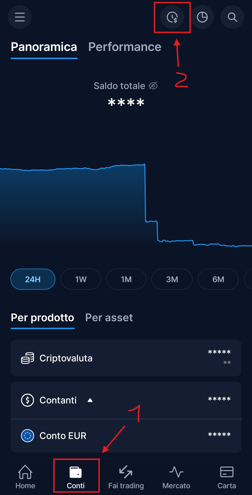

1. Aprire l'app e andare nella sezione **Conti**.
2. Premere il tasto in alto a destra, rappresentato da un orologio con il dollaro.

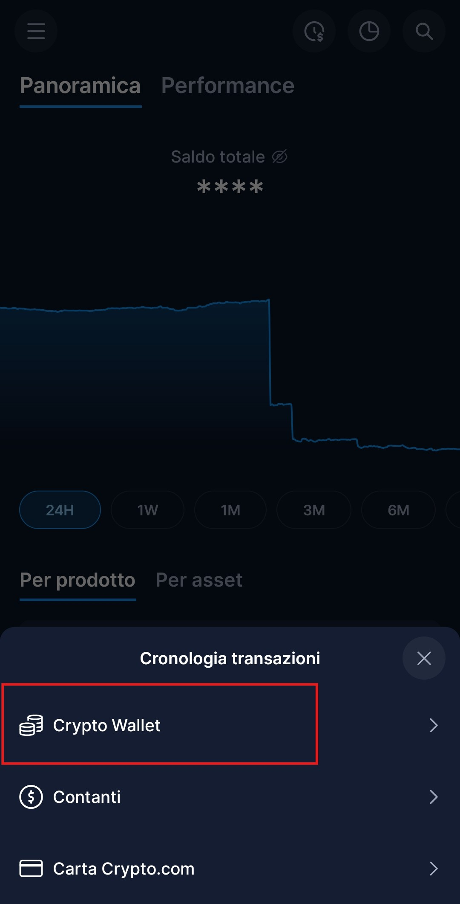

3. Premere su **Crypto Wallet**: si aprirà la cronologia delle transazioni.

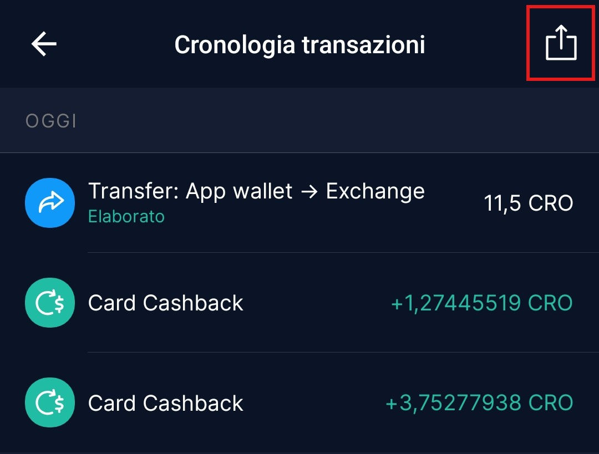

4. Premere sull'**icona in alto a destra**, rappresentata da un quadrato con una freccia.

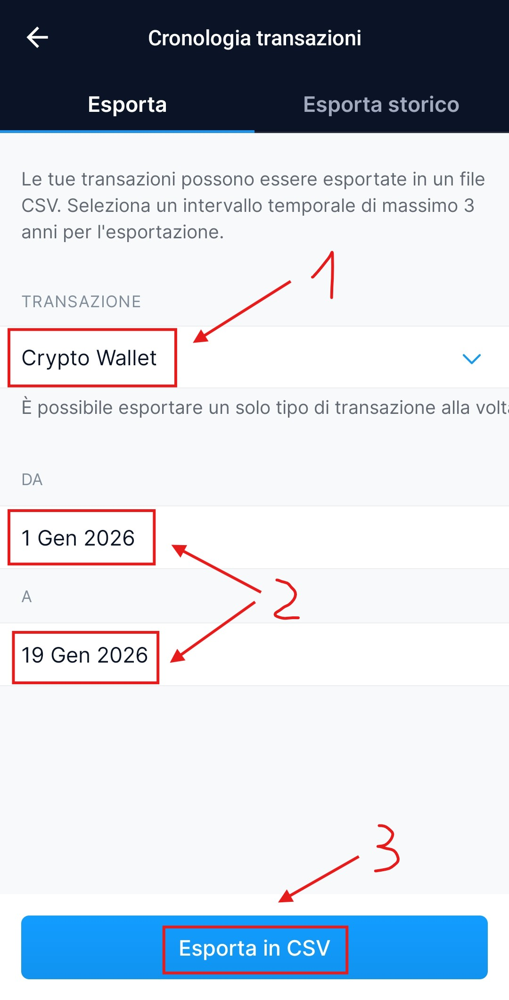

5. Assicurarsi che sia selezionato **Crypto Wallet**, scegliere le **date** in base alle proprie esigenze
   e premere **Esporta in CSV**.

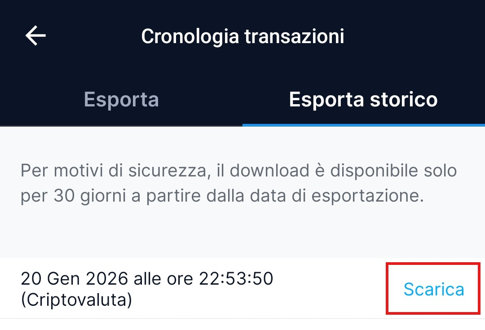

6. Una volta terminata l'esportazione, premere **Scarica**.

## Crypto.com Exchange {#cryptocom-exchange}

Da Crypto.com Exchange si possono scaricare due tipi di file: il **file delle transazioni** e il
**report mensile**.

> **NB** — il programma può importare entrambi, ma è importante scegliere e utilizzare **una sola
> tipologia per ogni periodo**, per evitare dati doppi e incoerenti.

### 1 – Come esportare il file delle transazioni {#1--come-esportare-il-file-delle-transazioni}

1. Collegarsi all'exchange da PC e andare nella sezione **Ordini**.
2. Selezionare la linguetta **Transazioni** e scegliere **Tutte le transazioni**.
3. Impostare nel **calendario** le date di cui si necessita l'importazione (massimo 180 giorni).
4. Premere il pulsante **Esporta**.

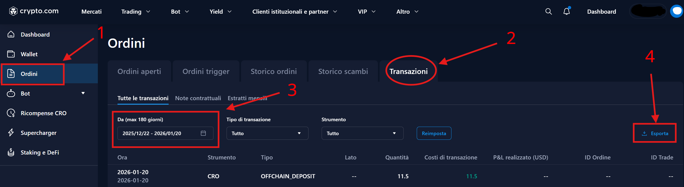

5. Premere su **Esporta CSV** (l'esportazione può durare parecchi minuti).

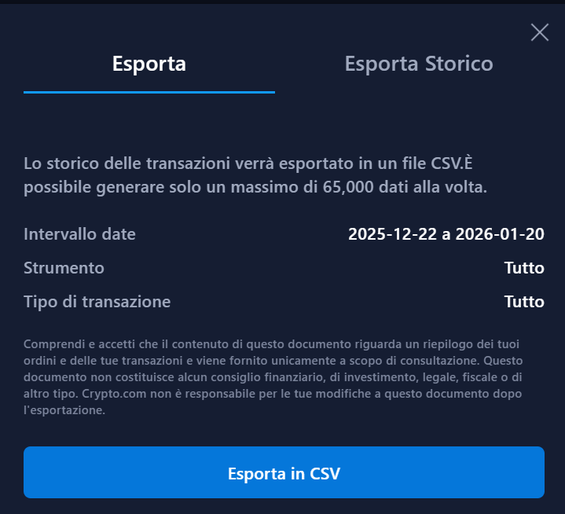

6. Una volta terminato, il file si trova nella sezione **Esporta Storico** della stessa maschera.

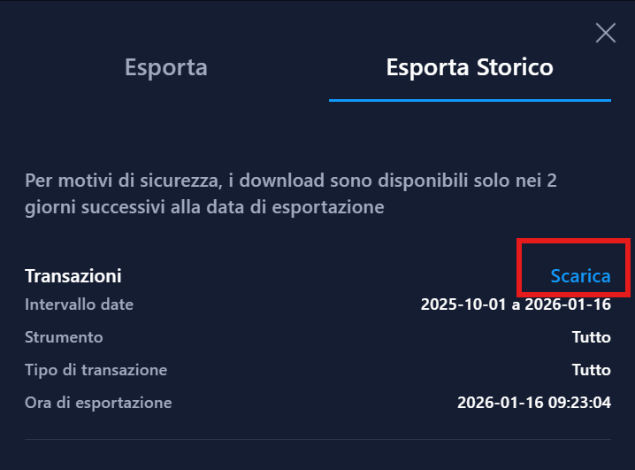

7. Premere **Scarica** per salvare il file sul PC.

### 2 – Come esportare i file dei movimenti mensili {#2--come-esportare-i-file-dei-movimenti-mensili}

1. Collegarsi all'exchange da PC e andare nella sezione **Ordini**.
2. Premere sulla linguetta **Transazioni** e selezionare **Estratti mensili**.
3. Su ogni riga premere **CSV** per scaricare il file.

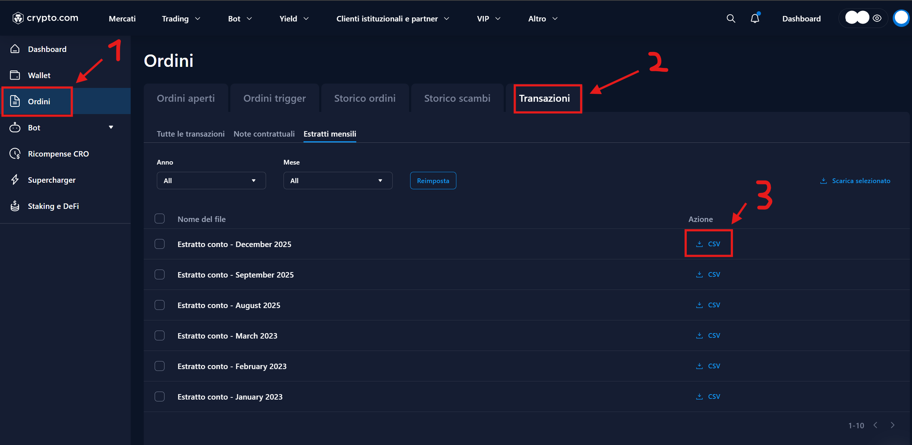

## Binance {#binance}

Da Binance si possono scaricare due tipi di file: il **file delle transazioni** e il
**report finanziario**.

> **NB** — dalle prove fatte durante il 2025 il file delle transazioni risulta più accurato nei
> movimenti.
>
> **NB2** — anche qui è importante utilizzare **una sola tipologia per ogni periodo**, per evitare dati
> doppi e incoerenti.

### 1 – Come esportare il file delle transazioni {#1--come-esportare-il-file-delle-transazioni-2}

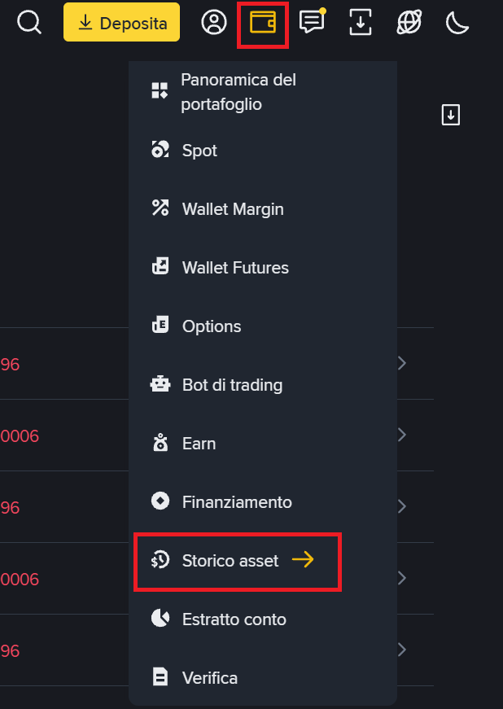

1. Premere sull'icona a forma di portafoglio in alto a destra.
2. Premere su **Storico Asset**.

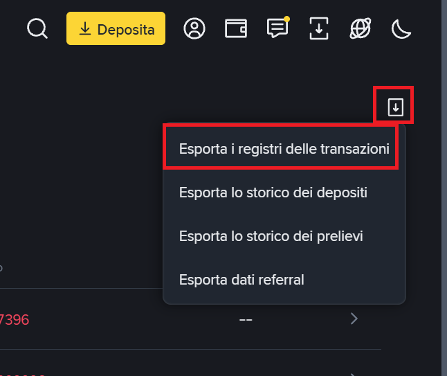

3. Nella schermata che si apre premere sull'**icona in alto a destra**, un riquadro con una freccia.
4. Selezionare l'opzione **Esporta i registri delle transazioni**.

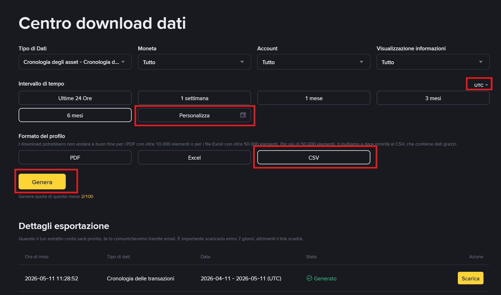

5. Nella maschera che si apre fare attenzione ai parametri evidenziati in rosso: in alto a destra
   selezionare **UTC** (il fuso orario da utilizzare), scegliere il periodo da esportare premendo
   **Personalizza**, scegliere **CSV** come tipo di file e premere **Genera**.

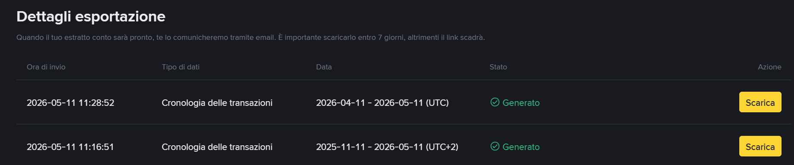

6. Nella parte bassa della finestra comparirà una riga con stato **Generando**: non serve aspettare, si
   può chiudere e tornare più tardi nella stessa maschera, dove comparirà **Scarica** accanto allo stato.

> **NB** — il programma tenta di individuare il fuso orario dal nome del file: se possibile, non
> rinominarlo.

### 2 – Come esportare il report finanziario {#2--come-esportare-il-report-finanziario}

1. Nel menù a sinistra premere su **Account**.
2. Premere su **Report finanziari**.
3. Selezionare il periodo desiderato e premere **Visualizza**: il file verrà scaricato.

> **NB** — i file di questa sezione vengono generati una volta all'anno.

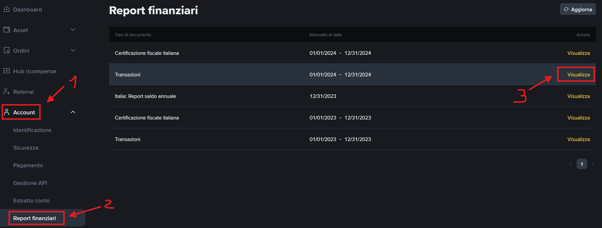

## OKX {#okx}

Per OKX la strada consigliata è lo **scaricamento dalle API** (chiave, secret e passphrase in
*Opzioni – ApiKey*), che recupera i conti Funding e Trading, i rendimenti di Simple Earn e, su richiesta,
l'archivio storico trimestrale che risale fino al 2021.

Restano comunque disponibili le due configurazioni di importazione **OKX_Funding** e **OKX_Trading** per
i file CSV esportati dal sito: in quel caso vanno esportati **entrambi** i conti, perché ciascun file
contiene solo una parte dei movimenti.

## CoinTracking.info {#cointrackinginfo}

Uno dei modi per importare i dati di exchange o blockchain non supportati direttamente da Giacenze Crypto
è passare da un'altra piattaforma di analisi dei dati: si importano i dati su quella piattaforma, li si
esportano e li si caricano su Giacenze Crypto.

Se si usa **CoinTracking** è opportuno ricordare che l'importazione massiva dei dati è a pagamento:
bisognerà quindi caricare, ad esempio, i dati di un singolo exchange, esportarli, cancellare i dati e
ricominciare il giro con gli exchange mancanti.

Il servizio è raggiungibile all'indirizzo
[cointracking.info](https://cointracking.info/dashboard.php).

1. Importare i dati premendo l'apposito pulsante e seguendo le indicazioni a video.

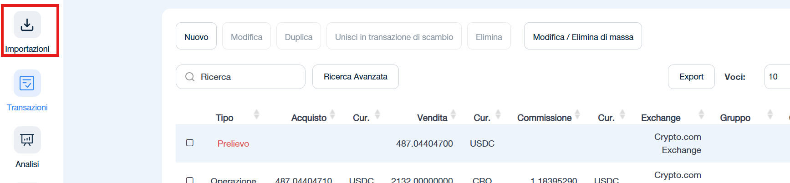

2. Una volta terminata l'importazione premere su **Transazioni**.
3. Premere il pulsante **Export**.

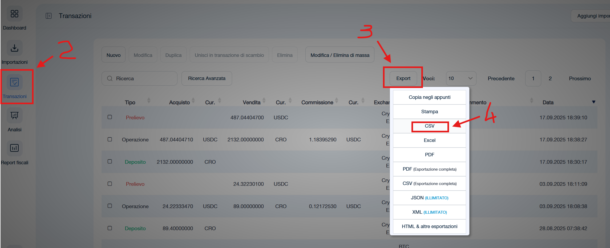

4. Selezionare il formato **CSV**: verrà scaricato il file da importare su Giacenze Crypto.
5. Premere ora il pulsante **Modifica/Elimina di massa**.

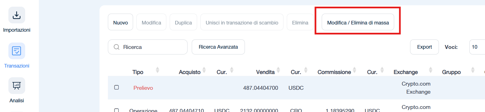

6. Nella maschera che compare selezionare **eliminare tutte le transazioni** e premere il tasto rosso
   **eliminare le voci selezionate**: in questo modo si potranno ricaricare altri dati ripartendo dal
   punto 1.

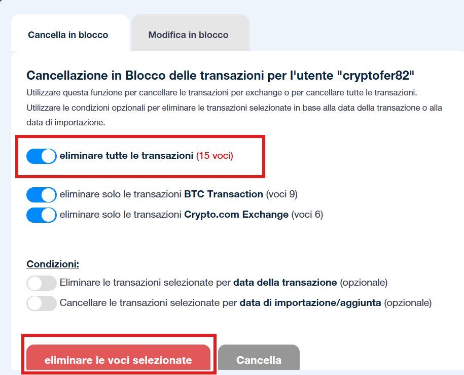

## Import CSV sul software Giacenze Crypto {#import-csv-sul-software-giacenze-crypto}

Per importare i dati nel programma procedere come segue.

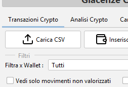

- Premere il pulsante **Carica CSV** presente nella sezione **Transazioni Crypto**.

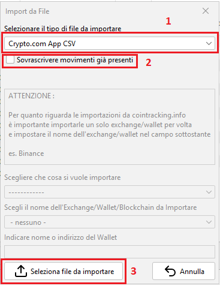

- Selezionare l'exchange dal menù a tendina.
- Decidere se usare l'opzione **Sovrascrivere movimenti già presenti**, che permette di sovrascrivere i
  movimenti già in archivio con quelli del file CSV selezionato. Se però si sta reimportando uno stesso
  periodo è consigliabile cancellare le movimentazioni di quel periodo e reimportarle da capo: i file
  degli exchange, se scaricati in momenti diversi, possono presentare incongruenze pur riferendosi allo
  stesso periodo (orari cambiati, valori ritoccati, ecc.).

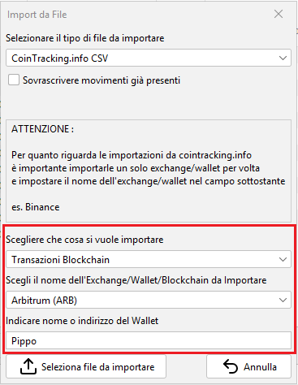

- Se si importa un CSV da una piattaforma come CoinTracking, che gestisce più wallet ed exchange insieme,
  va selezionata anche la tipologia e il **wallet di destinazione** prima di procedere.
- Premere quindi **Seleziona file da importare** per scegliere il file CSV da caricare.

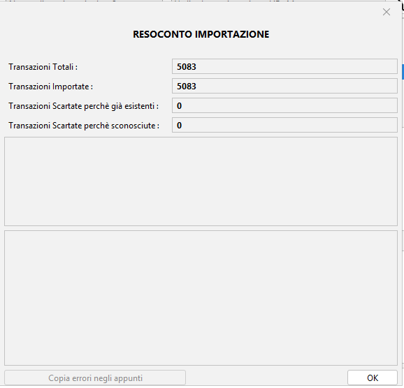

- Terminata l'importazione comparirà un resoconto come questo, in cui sono visibili anche gli eventuali
  errori, che è possibile copiare per segnalarli via mail o sul canale Telegram.

> Ogni file importato viene **conservato dal programma in forma compressa** e resta collegato ai
> movimenti che ne derivano: l'elenco si trova in *Analisi Crypto – Gestione Documentale* (oppure in
> *Opzioni – Export – Documenti di origine*), da cui i file possono essere riaperti, esportati o
> eliminati quando non sono più collegati ad alcun movimento.

[Torna all'indice della documentazione](./)
