# Opzioni di calcolo del Quadro W/RW

- [Introduzione](#introduzione)
- [Panoramica delle opzioni](#panoramica-delle-opzioni)
- [Caso studio 1 con esempi di calcolo](#caso-studio-1-con-esempi-di-calcolo)
- [Gestione dei trasferimenti tra wallet](#gestione-dei-trasferimenti-tra-wallet)
- [Caso studio 2: trasferimenti tra wallet](#caso-studio-2--esempi-di-gestione-dei-trasferimenti-tra-wallet)
- [Valorizzazione di staking, airdrop, cashback e reward](#valorizzazione-degli-staking-airdrop-cashback-e-reward-varie)
- [Gestione del LIFO nel Quadro W/RW](#gestione-del-lifo-nel-quadro-wrw)
- [Se il bollo è pagato](#opzione--se-bollo-pagato-mostra-solo-le-giacenze-di-inizio-e-fine-anno)
- [Gestione degli errori](#gestione-degli-errori)

## Introduzione {#introduzione}

Le opzioni di calcolo per il quadro RW che si trovano in **Opzioni** – **Opzioni di Calcolo**.

Partiamo però dallo spiegare qual è la logica che sta dietro il calcolo del quadro W/RW.

Le istruzioni dicono che

“*Nel quadro RW devono essere riportate le consistenze degli investimenti e delle attività valorizzate all’inizio di ciascun periodo d’imposta ovvero al primo giorno di detenzione (di seguito, “valore iniziale”) e al termine dello stesso ovvero al termine del periodo di detenzione nello stesso (di seguito, “valore finale”), nonché il periodo di possesso.**“*

Il programma farà proprio questo ovvero per ogni nuovo investimento o all’inizio dell’anno aprirà un nuovo rigo RW imputando il valore iniziale mentre alla chiusura dello stesso o alla fine dell’anno chiuderà il quadro con il valore finale.

> **NB** — resta comunque la possibilità di scegliere di visualizzare il solo valore iniziale e finale, senza alcun tipo di calcolo accessorio.

I righi cosi ottenuti verranno poi accorpati in un unico rigo calcolando i giorni di detenzione totali tramite media ponderata prendendo come riferimento il valore finale.

Questa possibilità viene data dalle istruzioni di compilazione del quadro RW che così recitano

“***In presenza di più operazioni della stessa natura, il contribuente può aggregare i dati per indicare un insieme di attività finanziarie omogenee caratterizzate, cioè, dai medesimi codici “investimento” e “Stato Estero”**. In tal caso il contribuente indicherà nel quadro RW i valori complessivi iniziali e finali del periodo di imposta, la media ponderata dei giorni di detenzione di ogni singola attività rapportati alla relativa consistenza, nonché l’IVAFE complessiva dovuta per il gruppo di attività. La predetta compilazione semplificata del quadro RW è ammessa a condizione che sia predisposto e conservato un apposito prospetto da esibire o trasmettere, su richiesta all’Amministrazione finanziaria, in cui sono specificati i dati delle singole attività finanziarie (in conformità ai criteri di valorizzazione delle attività contenuti nella circolare n. 38/E del 2013), i criteri di raggruppamento di queste ultime nonché le modalità di calcolo dell’IVAFE. *“

Es. Supponiamo che :

- All’ **01/01/2023** detenga **1 BTC** per un valore di **10000€**

- Il **30/01/2023** acquisti **1** ulteriore **BTC** per **15000€**

- Al **31/12/2023** il prezzo di 1 BTC sia 30000€ quindi detengo in totale **2 BTC** per un valore di **60000€**

In questo caso il programma genererà 2 righi :

RW1 : Val.Iniziale = 10000 € - Val.Finale = 30000€ - Giorni di detenzione = 365 - IC = 60€

RW2 : Val.Iniziale = 15000 € - Val.Finale = 30000€ - Giorni di detenzione = 335 - IC = 55€

Questi 2 righi però facendo parte di uno medesimo wallet e rispettando le regole di cui sopra verranno poi aggregati dal programma nel seguente modo.

- **Val. iniziale tot.** = Val. iniziale RW1 + Val. iniziale RW2 = **25.000 €**
- **Val. finale tot.** = Val. finale RW1 + Val. finale RW2 = **60.000 €**
- **GG di det. tot.** = (V.F.RW1 × GG.RW1 + V.F.RW2 × GG.RW2) / (V.F.RW1 + V.F.RW2) = **350**
- **IC tot.** = V.F.tot / 365 × GG.tot × 0,2% = **115 €**

## Panoramica delle opzioni {#panoramica-delle-opzioni}

Il programma prevede diverse opzioni per i calcoli del quadro W/RW per soddisfare diverse interpretazioni, un po' come caso studio un po' perché effettivamente non si capisce quale sia la più aderente alla normativa, insomma in questo modo ognuno è libero di fare un po' come crede.

Queste sono le opzioni nel loro complesso :

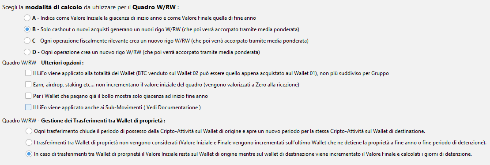

Come si può vedere le opzioni si distinguono sostanzialmente in 2 sezioni :

**Prima Sezione** - Si sceglie il momento in cui il programma deve scindere i righi.

In pratica qui si cerca di interpretare cosa intendono per “*fine periodo di detenzione*”.

A seconda di cosa scelgo vado a indicare al programma quando deve terminare un rigo RW che termina appunto a fine anno oppure **al termine del periodo di detenzione**.

Vediamo le opzioni a disposizione :

**Opzione A** – Questa è l’unica opzione che non prevede calcoli.

Viene messo come **valore iniziale** il valore del wallet a **inizio anno o primo movimento assoluto** e come **valore finale** il valore del wallet a **fine anno**.

**Opzione B** – Significa che il termine del periodo di detenzione delle cripto in mio possesso avviene solamente nel momento in cui ritorno in FIAT o faccio cashout.

**Opzione C** – Significa che il termine del periodo di detenzione avviene nel momento in cui c’è uno scambio fiscalmente rilevante (es. scambio per NFT ,Emoney Token o FIAT), ovviamente questo determina anche l’inizio di un nuovo periodo di detenzione per la cripto attività entrante.

**Opzione D** - Significa che il termine del periodo di detenzione avviene su ogni trade ossia nel momento in cui finisco di detenere una certa cripto.

Anche qui il termine del periodo di detenzione delle cripto uscente equivale anche all’inizio di un nuovo periodo di detenzione per la cripto entrante.

**Seconda Sezione** - Si sceglie come gestire casistiche particolari che possono riguardare la gestione dei trasferimenti così come la gestione dlle reward etc...

## Caso studio 1 con esempi di calcolo {#caso-studio-1-con-esempi-di-calcolo}

Supponiamo che le seguenti siano la totalità delle operazioni effettuate da un utente fino a fine 2023 :

| **Data** | **Tipo Scambio** | **Mon. Uscita** | **Qta Uscita** | **Mon. Entrata** | **Qta Entrata** | **Valore Transazione** |
|---|---|---|---|---|---|---|
| 2022-07-01 | ACQUISTO CRYPTO | EUR | -18100 | BTC | 1 | € 18100.00 |
| 2023-01-10 | SCAMBIO CRYPTO | BTC | -0.5 | ETH | 6.5 | € 8009.79 |
| 2023-01-15 | ACQUISTO CRYPTO | EUR | -1930 | BTC | 0.1 | € 1930.00 |
| 2023-05-30 | SCAMBIO CRYPTO | ETH | -2.5 | USDC | 4730 | € 4412.98 |
| 2023-08-30 | VENDITA CRYPTO | ETH | -4 | EUR | 6360 | € 6359.10 |

Nel caso specificato mi ritrovo ad avere ad inizio **01/01/2023** le seguenti Crypto:

| **Moneta** | **Quantità** | **Valore** |
|---|---|---|
| BTC | 1 | € 15428.81 |

Mentre alla fine del **31/12/2023** queste:

| **Moneta** | **Quantità** | **Valore** |
|---|---|---|
| BTC | 0.6 | € 22983.46 |
| USDC | 4730 | € 4286.31 |

Vediamo come saranno ora i calcoli e a quanto ammontarà l’IC a seconda dell’opzione scelta.

### Cosa succede se si seleziona l’opzione A {#cosa-succede-se-si-seleziona-lopzione-a}

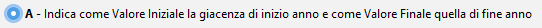

Se si selezione l’opzione A andiamo a dire al programma che quello che ci interessa per la compilazione del quadro W/RW sono solamente il valore iniziale e finale del Wallet.

Il Valore iniziale sarà il valore del Wallet all’inizio dell’anno o nel caso in cui il wallet sia stato movimentato per la prima volta in assoluto nell’anno di competenza fiscale sarà il valore del primo movimento.

Stessa cosa per la data iniziale.

Il Valore e la data finali saranno invece quelle del 31/12.

Nel nostro esempio quindi la situazione del Wallet sarà questa :

| **Moneta Iniziale** | **Qta Iniziale** | **Data Inizio Detenzione** | **Valore Inizio Detenzione** | **Moneta Finale** | **Qta Finale** | **Data Fine Detenzione** | **Valore Fine detenzione** | **GG di detenzione** | **Causale** |
|---|---|---|---|---|---|---|---|---|---|
| BTC | 1 | 2023-01-01 | € 15428.81 | BTC | 0.6 | 2023-12-31 | € 22983.46 | 365 | Fine Anno |
| USDC | 0 | 2023-01-01 | € 0.00 | USDC | 4730 | 2023-12-31 | € 4286.31 | 365 | Fine Anno |

Che si traduce nel seguente rigo per l’RW

| **Valore Iniziale** | **Valore Finale** | **Giorni di Detenzione** | **IC Calcolata** |
|---|---|---|---|
| € 15428.81 | € 27269.77 | 365 | € 54.54 |

### Cosa succede se si seleziona l’opzione B {#cosa-succede-se-si-seleziona-lopzione-b}

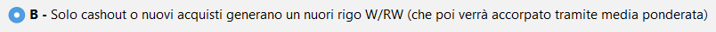

Se selezioniamo l’opzione B andiamo a dire al programma che la discriminante per la chiusura / apertura di un nuovo rigo del quadro RW è sostanzialmente lo scambio tra Crypto e FIAT ed eventuali cashout o Rewards.

In questo caso i valori che comporranno poi i singoli quadri sono questi :

| **Moneta Iniziale** | **Qta Iniziale** | **Data Inizio Detenzione** | **Valore Inizio Detenzione** | **Moneta Finale** | **Qta Finale** | **Data Fine Detenzione** | **Valore Fine detenzione** | **GG di detenzione** | **Causale** |
|---|---|---|---|---|---|---|---|---|---|
| BTC | 0.3076923 | 2023-01-01 | € 4747.33 | ETH | 4 | 2023-08-30 | € 6359.10 | 242 | Vendita |
| BTC | 0.5 | 2023-01-01 | € 7714.41 | BTC | 0.5 | 2023-12-31 | € 19152.88 | 365 | Fine Anno |
| BTC | 0.1 | 2023-01-15 | € 1930.00 | BTC | 0.1 | 2023-12-31 | € 3830.58 | 351 | Fine Anno |
| BTC | 0.1923077 | 2023-01-01 | € 2967.08 | USDC | 4730 | 2023-12-31 | € 4286.31 | 365 | Fine Anno |

Mentre l’RW aggregato è il seguente:

| **Valore Iniziale** | **Valore Finale** | **Giorni di Detenzione** | **IC Calcolata** |
|---|---|---|---|
| € 17358.82 | € 33628.87 | 340.15 | € 62.68 |

Come si può notare l’unico movimento che ha generato una chiusura anticipata del quadro è stata la vendita avvenuta il 30/08/2023 di 4 ETH.

Sempre in questo esempio si può notare che come valore iniziale è stato presa una quota del valore iniziale dei btc posseduti calcolati tramite LiFo, infatti all’inizio dell’anno avevo dei BTC che poi ho venduto per ETH e alla fine ho scambiato per EURO.

E’ stato quindi il solo passaggio in Euro a determinare la fine dell’investimento che era partito dai BTC che avevo ad inizio anno.

### Cosa succede se si seleziona l’opzione C {#cosa-succede-se-si-seleziona-lopzione-c}

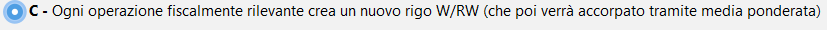

In questo caso la discriminante per la chiusura di un rigo quadro W/RW non è più il solo passaggio a FIAT ma bensì tutti gli scambi fiscalmente rilevanti.

**N.B**. per questo esempio considererò lo scambio tra ETH e USDC fiscalmente rilevante.

In questo caso i valori che comporranno poi i singoli quadri sono questi :

| **Moneta Iniziale** | **Qta Iniziale** | **Data Inizio Detenzione** | **Valore Inizio Detenzione** | **Moneta Finale** | **Qta Finale** | **Data Fine Detenzione** | **Valore Fine detenzione** | **GG di detenzione** | **Causale** |
|---|---|---|---|---|---|---|---|---|---|
| BTC | 0.1923077 | 2023-01-01 | € 2967.08 | ETH | 2.5 | 2023-05-30 | € 4412.98 | 150 | Scambio |
| BTC | 0.3076923 | 2023-01-01 | € 4747.33 | ETH | 4 | 2023-08-30 | € 6359.10 | 242 | Vendita |
| BTC | 0.5 | 2023-01-01 | € 7714.41 | BTC | 0.5 | 2023-12-31 | € 19152.88 | 365 | Fine Anno |
| BTC | 0.1 | 2023-01-15 | € 1930.00 | BTC | 0.1 | 2023-12-31 | € 3830.58 | 351 | Fine Anno |
| USDC | 4730 | 2023-05-30 | € 4412.98 | USDC | 4730 | 2023-12-31 | € 4286.31 | 216 | Fine Anno |

Mentre l’RW aggregato è il seguente:

| **Valore Iniziale** | **Valore Finale** | **Giorni di Detenzione** | **IC Calcolata** |
|---|---|---|---|
| € 21771.80 | € 38041.85 | 301.30 | € 62.81 |

A differenza del caso precedente qui anche lo scambio con USDC che abbiamo deciso a posteriori fosse rilevante fiscalmente (lo si può scegliere dalla funzione presente in Opzioni – EMoney Token) ha generato un momento in cui viene chiuso un rigo del quadro RW.

### Cosa succede se si seleziona l’opzione D {#cosa-succede-se-si-seleziona-lopzione-d}

In questo caso ogni trade comporta la chiusura di un rigo del quadro W/RW.

In questo caso i valori che comporranno poi i singoli quadri sono questi :

| **Moneta Iniziale** | **Qta Iniziale** | **Data Inizio Detenzione** | **Valore Inizio Detenzione** | **Moneta Finale** | **Qta Finale** | **Data Fine Detenzione** | **Valore Fine detenzione** | **GG di detenzione** | **Causale** |
|---|---|---|---|---|---|---|---|---|---|
| BTC | 0.5 | 2023-01-01 | € 7714.41 | BTC | 0.5 | 2023-01-10 | € 8009.79 | 10 | Scambio |
| ETH | 2.5 | 2023-01-10 | € 3080.69 | ETH | 2.5 | 2023-05-30 | € 4412.98 | 141 | Scambio |
| ETH | 4 | 2023-01-10 | € 4929.10 | ETH | 4 | 2023-08-30 | € 6359.10 | 233 | Vendita |
| BTC | 0.5 | 2023-01-01 | € 7714.41 | BTC | 0.5 | 2023-12-31 | € 19152.88 | 365 | Fine Anno |
| BTC | 0.1 | 2023-01-15 | € 1930.00 | BTC | 0.1 | 2023-12-31 | € 3830.58 | 351 | Fine Anno |
| USDC | 4730 | 2023-05-30 | € 4412.98 | USDC | 4730 | 2023-12-31 | € 4286.31 | 216 | Fine Anno |

Mentre l’RW aggregato è il seguente:

| **Valore Iniziale** | **Valore Finale** | **Giorni di Detenzione** | **IC Calcolata** |
|---|---|---|---|
| € 29781.59 | € 46051.64 | 248.53 | € 62.71 |

In questo caso, ogni movimento ha generato la chiusura di un rigo del quadro e la conseguente apertura di una nuova.

## Gestione dei trasferimenti tra Wallet {#gestione-dei-trasferimenti-tra-wallet}

L’Agenzia delle Entrate specifica che

“*Nel quadro RW, potrà essere compilato un rigo per ogni “portafoglio” o “conto digitale” o altro sistema di archiviazione o conservazione detenuto dal contribuente*“.

Detta così non è molto chiaro cosa intende l’AdE per portafoglio o conto digitale e potrebbe prestarsi a più interpretazioni.

Sicuramente ogni exchange è un portafoglio a parte ma per la defi come ci si comporta?

Si crea un rigo per ogni chiave privata, un rigo per ogni indirizzo e per ogni chain o un rigo per ogni portafoglio inteso come trust wallet, ledger etc?

Anche qui nel dubbio il programma lascia all’utente la possibilità di scegliere.

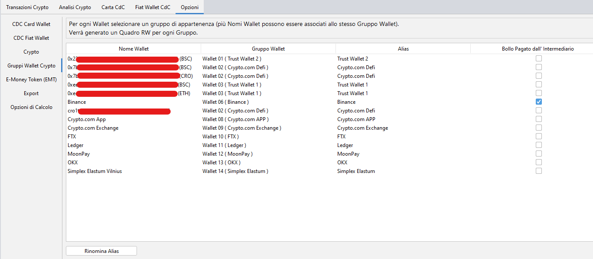

Come si può vedere dall’immagine è data piena libertà all’utente di decidere in che gruppo fanno parte i vari wallet/indirizzi defi caricati, verrà poi generato un nuovo rigo RW per ogni Gruppo Wallet.

**Ma come si comporta il programma in caso di trasferimenti?**

Di default in caso di trasferimenti il token viene spostato in toto con tutta la sua storia sul wallet di destinazione ma ovviamente ci sono diverse opzioni per decidere come gestire i trasferimenti.

**N.B. :** Affinchè il programma consideri correttamente i trasferimenti è importante classificare correttamente i movimenti di deposito e prelievo nella funzione “**Classificazione Depositi/Prelievi**” presente nella sezione “**Analisi Crypto**”.

Se questo non viene fatto i Depositi e Prelievi dovuti a dei trasferimenti non verranno trattati correttamente generando quindi errori di calcolo sia per quanto riguarda la plusvalenza sia per quanto riguarda il quadro RW.

## Caso Studio 2 : Esempi di gestione dei trasferimenti tra wallet {#caso-studio-2--esempi-di-gestione-dei-trasferimenti-tra-wallet}

Supponiamo di avere la seguente situazione:

A inizio 2023 anno possiedo 1 BTC sul Wallet A e 1 ETH sul Wallet B.

Il 30 di Giugno 2023 sposto 0,25 BTC dal Wallet A al Wallet B

Quindi facciamo finta che la situazione dei movimenti sui miei wallet sia la seguente :

| **Data** | **Wallet** | **Tipo Scambio** | **Mon. Uscita** | **Qta Uscita** | **Mon. Entrata** | **Qta Entrata** | **Valore Transazione** |
|---|---|---|---|---|---|---|---|
| 2022-07-16 | **A** | ACQUISTO CRYPTO | EUR | -20766.17 | BTC | 1 | 20766.17 |
| 2022-07-16 | **B** | ACQUISTO CRYPTO | EUR | -1241.60 | ETH | 1 | 1241.60 |
| 2023-06-30 | **A** | TRASFERIMENTO TRA WALLET | BTC | -0.25 |  |  | 6997.28 |
| 2023-06-30 | **B** | TRASFERIMENTO TRA WALLET |  |  | BTC | 0.25 | 6997.28 |

Nel caso specificato mi ritrovo ad avere al **01/01/2023** le seguenti Crypto:

| **Wallet** | **Moneta** | **Quantità** | **Valore** |
|---|---|---|---|
| **A** | BTC | 1 | € 15504.13 |
| **B** | ETH | 1 | € 1121.06 |

Mentre al **31/12/2023** queste:

| **Wallet** | **Moneta** | **Quantità** | **Valore** |
|---|---|---|---|
| **A** | BTC | 0,75 | € 28729.32 |
| **B** | BTC | 0,25 | € 9576.44 |
| **B** | ETH | 1 | € 2067.20 |

Nelle pagine successive vedremo come questo caso viene trattato a seconda delle opzioni scelte.

### Calcoli con biffata l’opzione per non considerare gli spostamenti tra Wallet di proprietà {#calcoli-con-biffata-lopzione-per-non-considerare-gli-spostamenti-tra-wallet-di-proprietà}

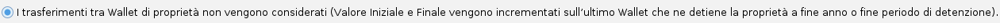

Questa la situazione riguardo i quadri RW per i 2 wallet

| **Wallet di riferimento** | **Valore Iniziale** | **Valore Finale** | **Giorni di Detenzione** | **IC Calcolata** |
|---|---|---|---|---|
| 01 ( **A** ) | € 11628.10 | € 28729.32 | 365.00 | € 57.46 |
| 02 ( **B** ) | € 4997.09 | € 11643.64 | 365.00 | € 23.29 |

IC TOTALE : **€ 80.75**

Questo invece il dettaglio della composizione del Wallet **A**

| **Wallet Iniziale** | **Moneta Iniziale** | **Qta Iniziale** | **Data Inizio Detenzione** | **Valore Inizio Detenzione** | **Wallet Finale** | **Moneta Finale** | **Qta Finale** | **Data Fine Detenzione** | **Valore Fine detenzione** | **GG di detenzione** | **Causale** |
|---|---|---|---|---|---|---|---|---|---|---|---|
| 01 ( **A** ) | BTC | 0.75 | 2023-01-01 | € 11628.10 | 01 ( **A** ) | BTC | 0.75 | 2023-12-31 | € 28729.32 | 365 | Fine Anno |

E quindi il dettaglio del Wallet **B**

| **Wallet Iniziale** | **Moneta Iniziale** | **Qta Iniziale** | **Data Inizio Detenzione** | **Valore Inizio Detenzione** | **Wallet Finale** | **Moneta Finale** | **Qta Finale** | **Data Fine Detenzione** | **Valore Fine detenzione** | **GG di detenzione** | **Causale** |
|---|---|---|---|---|---|---|---|---|---|---|---|
| 01 ( **A** ) | BTC | 0.25 | 2023-01-01 | € 3876.03 | 02 ( **B** ) | BTC | 0.25 | 2023-12-31 | € 9576.44 | 365 | Fine Anno |
| 02 ( **B** ) | ETH | 1 | 2023-01-01 | € 1121.06 | 02 ( **B** ) | ETH | 1 | 2023-12-31 | € 2067.20 | 365 | Fine Anno |

Come si può notare se non si sceglie nessuna delle opzioni riguardanti la gestione dei trasferimenti i 0.25 BTC che ho trasferito sul Wallet **B** risultano come fossero sempre appartenuti ad esso.

### Calcoli con biffata l’opzione per mantenere il valore iniziale sul Wallet di origine {#calcoli-con-biffata-lopzione-per-mantenere-il-valore-iniziale-sul-wallet-di-origine}

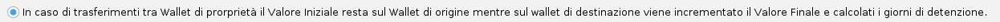

Questa la situazione riguardo i quadri RW per i 2 wallet

| **Wallet di riferimento** | **Valore Iniziale** | **Valore Finale** | **Giorni di Detenzione** | **IC Calcolata** |
|---|---|---|---|---|
| 01 ( **A** ) | € 15504.13 | € 28729.32 | 365.00 | € 57.46 |
| 02 ( **B** ) | € 1121.06 | € 11643.64 | 365.00 | € 23.29 |

IC TOTALE : **€ 80.75**

Questo invece il dettaglio della composizione del Wallet **A**

| **Wallet Iniziale** | **Moneta Iniziale** | **Qta Iniziale** | **Data Inizio Detenzione** | **Valore Inizio Detenzione** | **Wallet Finale** | **Moneta Finale** | **Qta Finale** | **Data Fine Detenzione** | **Valore Fine detenzione** | **GG di detenzione** | **Causale** |
|---|---|---|---|---|---|---|---|---|---|---|---|
| 01 ( **A** ) | BTC | 0.75 | 2023-01-01 | € 11628.10 | 01 ( **A** ) | BTC | 0.75 | 2023-12-31 | € 28729.32 | 365 | Fine Anno |

E quindi il dettaglio del Wallet **B**

| **Wallet Iniziale** | **Moneta Iniziale** | **Qta Iniziale** | **Data Inizio Detenzione** | **Valore Inizio Detenzione** | **Wallet Finale** | **Moneta Finale** | **Qta Finale** | **Data Fine Detenzione** | **Valore Fine detenzione** | **GG di detenzione** | **Causale** |
|---|---|---|---|---|---|---|---|---|---|---|---|
| 01 ( **A** ) | BTC | 0.25 | 2023-01-01 | € 3876.03 | 02 ( **B** ) | BTC | 0.25 | 2023-12-31 | € 9576.44 | 365 | Fine Anno |
| 02 ( **B** ) | ETH | 1 | 2023-01-01 | € 1121.06 | 02 ( **B** ) | ETH | 1 | 2023-12-31 | € 2067.20 | 365 | Fine Anno |

In questo caso il valore iniziale resta sempre sul Wallet di origine mentre il valore finale e i giorni di detenzione sul wallet di destinazione.

Nel rigo RW del Wallet **A** il valore iniziale corrisponde infatti al valore dell’intero BTC che possedevo all’1/1 mentre il valore finale è relativo alla sola parte detenuta a fine anno ovvero 0,75.

Discorso analogo per il Wallet **B** il valore iniziale è relativo al solo ETH detenuto ad inizio anno mentre il valore finale è la somma dei 0,25 BTC spostati e l’ETH rimanente.

I colori nella tabella sono indicativi di cosa andrà nel rigo del Wallet **A** e cosa andrà nel rigo del Wallet **B**.

### Calcoli con biffata l’opzione per chiudere ed aprire un nuovo rigo W/RW in caso di trasferimenti {#calcoli-con-biffata-lopzione-per-chiudere-ed-aprire-un-nuovo-rigo-wrw-in-caso-di-trasferimenti}

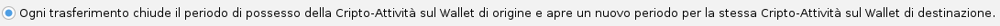

In questo caso ogni volta che sono di fronte ad un trasferimento di fondi tra un wallet ed un altro di mia proprietà chiuderò la posizione nel wallet di origine per aprirne una nuova nel wallet di destinazione.

Partendo sempre dal nostro esempio questa sarà la situazione riguardo i quadri RW per i 2 wallet

| **Wallet di riferimento** | **Valore Iniziale** | **Valore Finale** | **Giorni di Detenzione** | **IC Calcolata** |
|---|---|---|---|---|
| 01 ( **A** ) | € 15504.13 | € 35726.60 | 328.96 | € 64.40 |
| 02 ( **B** ) | € 8118.34 | € 11643.64 | 216.96 | € 13.84 |

IC TOTALE : **€ 78.24**

Questo il dettaglio della composizione del Wallet **A**

| **Wallet Iniziale** | **Moneta Iniziale** | **Qta Iniziale** | **Data Inizio Detenzione** | **Valore Inizio Detenzione** | **Wallet Finale** | **Moneta Finale** | **Qta Finale** | **Data Fine Detenzione** | **Valore Fine detenzione** | **GG di detenzione** | **Causale** |
|---|---|---|---|---|---|---|---|---|---|---|---|
| 01 ( **A** ) | BTC | 0.25 | 2023-01-01 | € 3876.03 | 01 ( **A** ) | BTC | 0.25 | 2023-06-30 | € 6997.28 | 181 | Trasferimento su altro Wallet |
| 01 ( **A** ) | BTC | 0.75 | 2023-01-01 | € 11628.10 | 01 ( **A** ) | BTC | 0.75 | 2023-12-31 | € 28729.32 | 365 | Fine Anno |

E quindi il dettaglio del Wallet **B**

| **Wallet Iniziale** | **Moneta Iniziale** | **Qta Iniziale** | **Data Inizio Detenzione** | **Valore Inizio Detenzione** | **Wallet Finale** | **Moneta Finale** | **Qta Finale** | **Data Fine Detenzione** | **Valore Fine detenzione** | **GG di detenzione** | **Causale** |
|---|---|---|---|---|---|---|---|---|---|---|---|
| 01 ( **B** ) | BTC | 0.25 | 2023-06-30 | € 6997.28 | 02 ( **B** ) | BTC | 0.25 | 2023-12-31 | € 9576.44 | 185 | Fine Anno |
| 02 ( **B** ) | ETH | 1 | 2023-01-01 | € 1121.06 | 02 ( **B** ) | ETH | 1 | 2023-12-31 | € 2067.20 | 365 | Fine Anno |

Come si può notare i 0,25 BTC spostati in data 30/06/2023 generano le seguenti posizioni sui 2 Wallet :

Sul Wallet A → 0.25 BTC posseduti dal 01/01/2023 al 30/06/2023 (181gg)

Sul Wallet B → 0.25 BTC posseduti dal 30/06/2023 al 31/12/2023 (185gg)

Questo andrà ovviamente ad incidere sul calcolo dell’IC perché inciderà anche il valore di BTC al momento dello spostamento.

L’IC infatti passa dagli **€ 80.75** dei precedenti esempi ai **€ 78.24** attuali.

## Valorizzazione degli Staking, Airdrop, Cashback e Reward varie {#valorizzazione-degli-staking-airdrop-cashback-e-reward-varie}

In “**Opzioni** – **Opzioni Rewards**” sarà possibile scegliere per ogni tipologia di reward se si tratta o meno di un “**provento da detenzione**”.

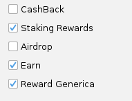

**Cosa significa questo?**

Significa che il provento viene tassato al momento della ricezione sull’intero valore e quello poi diventa il nuovo costo di carico per le future vendite.

Esempio :

Il 03/10/2023 riceviamo 0,01 ETH come provento da Staking del valore di € 15,83.

Quel valore genera immediatamente una plusvalenza pari a € 15,83 e diventa il nuovo costo di carico per quei 0,01 ETH.

Nel caso in cui invece si decidesse che quel tipo di Reward non debba essere trattata come “provento da detenzione” semplicemente il costo di carico della Reward sarà pari a Zero.

**Per quanto riguarda il calcolo sull’RW invece come si comporta il programma?**

Partendo dall’esempio precedente supponiamo di avere una situazione di questo genere :

| **Data** | **Tipo Scambio** | **Mon. Uscita** | **Qta Uscita** | **Mon. Entrata** | **Qta Entrata** | **Valore Transazione** | **Costo di Carico** | **Plusvalenza** |
|---|---|---|---|---|---|---|---|---|
| 2022-07-16 | ACQUISTO CRYPTO | EUR | -1241.60 | ETH | 1 | € 1241.60 | € 1241.60 | € 0.00 |
| 2023-10-03 | STAKING REWARD |  |  | ETH | 0.01 | € 15.83 | € 15.83 | € 15.83 |

In questo esempio mi ritrovo ad inizio e fine anno a detenere quanto segue :

01/01/2023 → 1.00 ETH del valore di € 1121.06

31/12/2023 → 1.01 ETH del valore di € 2087.87

**Caso 1 - La reward è classificata come “provento da detenzione”**

Quadro RW aggregato:

| **Wallet di riferimento** | **Valore Iniziale** | **Valore Finale** | **Giorni di Detenzione** | **IC Calcolata** |
|---|---|---|---|---|
| 01 (A) | € **1136.89** | € 2087.87 | 362.28 | € 4.14 |

Dettaglio delle movimentazioni :

| **Moneta Iniziale** | **Qta Iniziale** | **Data Inizio Detenzione** | **Valore Inizio Detenzione** | **Moneta Finale** | **Qta Finale** | **Data Fine Detenzione** | **Valore Fine detenzione** | **GG di detenzione** | **Causale** |
|---|---|---|---|---|---|---|---|---|---|
| ETH | 1 | 2023-01-01 | € 1121.06 | ETH | 1 | 2023-12-31 | € 2067.20 | 365 | Fine Anno |
| ETH | 0.01 | 2023-10-03 | € **15.83** | ETH | 0.01 | 2023-12-31 | € 20.67 | 90 | Fine Anno |

**Caso 2 - la reward non è classificata come “provento da detenzione” o è stata biffata la seguente opzione**

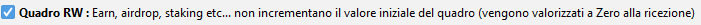

Quadro RW aggregato:

| **Wallet di riferimento** | **Valore Iniziale** | **Valore Finale** | **Giorni di Detenzione** | **IC Calcolata** |
|---|---|---|---|---|
| 01 (A) | € **1121.06** | € 2087.87 | 362.28 | € 4.14 |

Dettaglio delle movimentazioni :

| **Moneta Iniziale** | **Qta Iniziale** | **Data Inizio Detenzione** | **Valore Inizio Detenzione** | **Moneta Finale** | **Qta Finale** | **Data Fine Detenzione** | **Valore Fine detenzione** | **GG di detenzione** | **Causale** |
|---|---|---|---|---|---|---|---|---|---|
| ETH | 1 | 2023-01-01 | € 1121.06 | ETH | 1 | 2023-12-31 | € 2067.20 | 365 | Fine Anno |
| ETH | 0.01 | 2023-10-03 | € **0.00** | ETH | 0.01 | 2023-12-31 | € 20.67 | 90 | Fine Anno |

Come si può vedere l’unica cosa che cambia è che nel primo caso il valore della reward al momento della ricezione viene aggiunto al valore iniziale del quadro W/RW mentre nel secondo caso no.

## Gestione del LiFo nel Quadro W/RW {#gestione-del-lifo-nel-quadro-wrw}

L’ultima opzione di calcolo disponibile è quella relativa a come il programma utilizza il LiFo per il calcolo dell’RW.

Di default il programma utilizza il LiFo sul singolo gruppo wallet quindi ad esempio per trovare quale BTC sto vendendo vado a cercare l’ultimo BTC acquistato (scambiato, regalato etc...) nel solo Gruppo Wallet su cui sto effettuando la vendita.

Viceversa biffando la seguente opzione vado a cercare l’ultimo BTC entrato sull’intero gruppo dei Wallet a mia disposizione.

**Come si traduce questo sul quadro RW?**

Per rispondere a questa domanda il modo più semplice è come al solito fare un esempio.

Supponiamo di partire da questa situazione:

| **Data** | **Wallet** | **Tipo Scambio** | **Mon. Uscita** | **Qta Uscita** | **Mon. Entrata** | **Qta Entrata** | **Valore Transazione** | **Costo di Carico** |
|---|---|---|---|---|---|---|---|---|
| 2022-07-18 | A | ACQUISTO CRYPTO | EUR | -20824.92 | BTC | 1 | € 20824.92 | € 20824.92 |
| 2022-07-18 | B | ACQUISTO CRYPTO | EUR | -20824.92 | BTC | 1 | € 20824.92 | € 20824.92 |
| 2023-05-15 | B | ACQUISTO CRYPTO | EUR | -24784.13 | BTC | 1 | € 24784.13 | € 24784.13 |
| 2023-09-01 | A | VENDITA CRYPTO | BTC | -0.5 | EUR | 12003.80 | € 12003.80 |  |

La situazione ad inizio e fine 2023 quindi sarà la seguente

| **Wallet** | **Cripto Inizio Anno** | **Qta Inizio Anno** | **Valore Inizio Anno** | **Cripto Fine Anno** | **Qta Fine Anno** | **Valore Fine Anno** |
|---|---|---|---|---|---|---|
| A | BTC | 1 | € 15428.81 | BTC | 0,5 | € 19152.88 |
| B | BTC | 1 | € 15428.81 | BTC | 2 | € 76611.53 |

La vendita dei 0,5 BTC del Wallet A riguarderà di default i BTC di inizio anno dello stesso Wallet mentre se si vuole considerare il tutto come un unico grande wallet (biffando l’opzione apposita) il BTC che andrò a vendere sarà quello acquistato sul Wallet B il 15/05/2023.

**NB.** Il programma in ogni caso non ragiona mai per Singolo Wallet ma per Gruppi di Wallet.

I Gruppi sono quelli scelti in “**Opzioni**” – “**Gruppi Wallet Crypto**”.

I Wallet appartenenti allo stesso Gruppo Wallet vengono visti dal programma come un unica entità.

### Default : LiFo sul singolo Gruppo Wallet {#default--lifo-sul-singolo-gruppo-wallet}

Con le opzioni di default il risultato è quanto segue:

Quadro RW aggregato:

| **Wallet di riferimento** | **Valore Iniziale** | **Valore Finale** | **Giorni di Detenzione** | **IC Calcolata** |
|---|---|---|---|---|
| 01 ( A ) | € 15428.82 | € 31156.68 | 318.38 | 54.35 |
| 02 ( B ) | € 40212.94 | € 76611.52 | 298.00 | 125.10 |

IC Totale = **€ 179.45**

Dettaglio delle movimentazioni Wallet A :

| **Wallet Iniziale** | **Moneta Iniziale** | **Qta Iniziale** | **Data Inizio Detenzione** | **Valore Inizio Detenzione** | **Wallet Finale** | **Moneta Finale** | **Qta Finale** | **Data Fine Detenzione** | **Valore Fine detenzione** | **GG di detenzione** | **Causale** |
|---|---|---|---|---|---|---|---|---|---|---|---|
| 01 ( A ) | BTC | 0.5 | 2023-01-01 | € 7714.41 | 01 ( A ) | BTC | 0.5 | 2023-09-01 | € 12003.80 | 244 | Vendita |
| 01 ( A ) | BTC | 0.5 | 2023-01-01 | € 7714.41 | 01 ( A ) | BTC | 0.5 | 2023-12-31 | € 19152.88 | 365 | Fine Anno |

Dettaglio delle movimentazioni Wallet B :

| **Wallet Iniziale** | **Moneta Iniziale** | **Qta Iniziale** | **Data Inizio Detenzione** | **Valore Inizio Detenzione** | **Wallet Finale** | **Moneta Finale** | **Qta Finale** | **Data Fine Detenzione** | **Valore Fine detenzione** | **GG di detenzione** | **Causale** |
|---|---|---|---|---|---|---|---|---|---|---|---|
| 02 ( B ) | BTC | 1 | 2023-01-01 | € 15428.81 | 02 ( B ) | BTC | 1 | 2023-12-31 | € 38305.76 | 365 | Fine Anno |
| 02 ( B ) | BTC | 1 | 2023-05-15 | € 24784.13 | 02 ( B ) | BTC | 1 | 2023-12-31 | € 38305.76 | 231 | Fine Anno |

Come si vede il mezzo BTC venduto sul Wallet A è quello di inizio anno dello stesso Wallet

### Opzionale : LiFo applicato alla totalità dei Wallet {#opzionale--lifo-applicato-alla-totalità-dei-wallet}

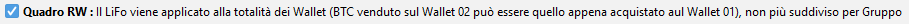

Con questa opzione biffata il risultato sarà invece il seguente

Quadro RW aggregato:

| **Wallet di riferimento** | **Valore Iniziale** | **Valore Finale** | **Giorni di Detenzione** | **IC Calcolata** |
|---|---|---|---|---|
| 01 ( A ) | € 24784.14 | € 31156.68 | 184.38 | 31.48 |
| 02 ( B ) | € 30857.62 | € 76611.52 | 365.00 | 153.22 |

IC Totale : **€ 184.70**

Dettaglio delle movimentazioni Wallet A :

| **Wallet Iniziale** | **Moneta Iniziale** | **Qta Iniziale** | **Data Inizio Detenzione** | **Valore Inizio Detenzione** | **Wallet Finale** | **Moneta Finale** | **Qta Finale** | **Data Fine Detenzione** | **Valore Fine detenzione** | **GG di detenzione** | **Causale** |
|---|---|---|---|---|---|---|---|---|---|---|---|
| 02 ( B ) | BTC | 0.5 | 2023-05-15 | 12392.07 | 01 ( A ) | BTC | 0.5 | 2023-09-01 | 12003.80 | 110 | Vendita |
| 02 ( B ) | BTC | 0.5 | 2023-05-15 | 12392.07 | 01 ( A ) | BTC | 0.5 | 2023-12-31 | 19152.88 | 231 | Fine Anno |

Dettaglio delle movimentazioni Wallet B :

| **Wallet Iniziale** | **Moneta Iniziale** | **Qta Iniziale** | **Data Inizio Detenzione** | **Valore Inizio Detenzione** | **Wallet Finale** | **Moneta Finale** | **Qta Finale** | **Data Fine Detenzione** | **Valore Fine detenzione** | **GG di detenzione** | **Causale** |
|---|---|---|---|---|---|---|---|---|---|---|---|
| 01 ( A ) | BTC | 1 | 2023-01-01 | 15428.81 | 02 ( B ) | BTC | 1 | 2023-12-31 | 38305.76 | 365 | Fine Anno |
| 02 ( B ) | BTC | 1 | 2023-01-01 | 15428.81 | 02 ( B ) | BTC | 1 | 2023-12-31 | 38305.76 | 365 | Fine Anno |

Come si può notare si formano delle aberrazioni nei calcoli, monete partite dal Wallet B le ritrovo a fine anno nel Wallet A e viceversa questo appunto perché il LiFo viene applicato alla totalità dei wallet ma i Wallet poi devono essere distinti per l’RW.

Anche l’IC totale sarà diversa perché cambia il periodo di detenzione e l’IC viene rapportato ad esso.

### Opzionale : LiFo applicato anche ai SubMovimenti {#opzionale--lifo-applicato-anche-ai-submovimenti}

Per poter spiegare bene questa opzione bisogna prima partire da un esempio più semplice.

Supponiamo di avere la seguente situazione :

**A** - 01/01/2023 → **Acquisto 1 ETH** per **1000 EUR** (Residuo Wallet 1 ETH)

**B** - 01/02/2023 → **Acquisto 1 ETH** per **2000 EUR** (Residuo Wallet 2 ETH)

**C** - 01/03/2023 → **Vendo 2 ETH** per **0,2BTC** (Residuo Wallet 0,2 BTC)

**D** - 01/04/2023 → **Vendo 0,15 BTC** per **10000 EUR** (Residuo Wallet 0,05 BTC)

Nella modalità di Default, il programma, nel momento in cui gestisco il movimento **C**, prende e mette nello stack relativo ai 0,2 BTC acquistati l’origine del suo dato ( i 2 acquisti di ETH ) così come sono (seguendo il LiFo) e stessa cosa nel momento della vendita dei 0,15 BTC.

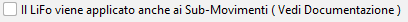

**Default** (opzione non biffata) esempio grafico :

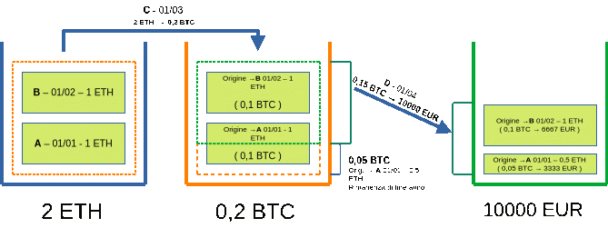

**Default** (opzione non biffata) Tabella di dettaglio :

| **Moneta Iniziale** | **Qta Iniziale** | **Data Inizio Detenzione** | **Valore Inizio Detenzione** | **Moneta Finale** | **Qta Finale** | **Data Fine Detenzione** | **Valore Fine detenzione** | **GG di detenzione** | **Causale** |
|---|---|---|---|---|---|---|---|---|---|
| ETH | 0,5 | 2023-01-01 | € 1000.00 | BTC | 0.05 | 2023-04-01 | € 3333.33 | 91 | Vendita |
| ETH | 1 | 2023-02-01 | € 1000.00 | BTC | 0.1 | 2023-04-01 | € 6666.67 | 60 | Vendita |
| ETH | 0,5 | 2023-01-01 | € 1000.00 | BTC | 0.05 | 2023-12-31 | € 1915.29 | 365 | Fine Anno |

**Default** (opzione non biffata) Quadro RW aggregato:

| **Wallet di riferimento** | **Valore Iniziale** | **Valore Finale** | **Giorni di Detenzione** | **IC Calcolata** |
|---|---|---|---|---|
| 01 (A) | € 3000.00 | € 11915.29 | 117.70 | € 7.68 |

Nel momento in cui scelgo invece di utilizzare questa opzione, il programma è come se dividesse ogni singolo movimento reale in molti sub-movimenti e su ognuno di questi ci applica il LiFo.

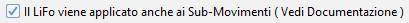

(Opzione biffata) esempio grafico :

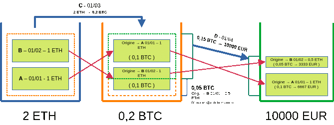

(Opzione biffata) Tabella di dettaglio :

| **Moneta Iniziale** | **Qta Iniziale** | **Data Inizio Detenzione** | **Valore Inizio Detenzione** | **Moneta Finale** | **Qta Finale** | **Data Fine Detenzione** | **Valore Fine detenzione** | **GG di detenzione** | **Causale** |
|---|---|---|---|---|---|---|---|---|---|
| ETH | 0,5 | 2023-02-01 | € 1000.00 | BTC | 0.05 | 2023-04-01 | € 3333.33 | 60 | Vendita |
| ETH | 1 | 2023-01-01 | € 1000.00 | BTC | 0.1 | 2023-04-01 | € 6666.67 | 91 | Vendita |
| ETH | 0,5 | 2023-02-01 | € 1000.00 | BTC | 0.05 | 2023-12-31 | € 1915.29 | 334 | Fine Anno |

(Opzione biffata) Quadro RW aggregato:

| **Wallet di riferimento** | **Valore Iniziale** | **Valore Finale** | **Giorni di Detenzione** | **IC Calcolata** |
|---|---|---|---|---|
| 01 (A) | € 3000.00 | € 11915.29 | 121.39 | € 7.93 |

Questa tra l’altro sembrerebbe essere, al netto di errori di valutazione, la modalità che viene utilizzata anche da Tatax per i calcoli.

Come si può notare questa opzione può creare delle situazioni un po' strane, se ad esempio prima di vendere per euro converto i BTC in WBTC succederà che verranno nuovamente invertiti i movimenti originali portando a valori diversi di IC e giorni di detenzione (in particolari saranno uguali a quelli del primo esempio), questo pur avendo BTC e WBTC stesso identico valore.

Ricapitolando:

- **Default** (Opzione non barrata)→ LiFo applicato ai soli movimenti Reali.

- Con Opzione Biffata → LiFo applicata a tutti i sub-movimenti.

## Opzione : Se Bollo Pagato mostra solo le giacenze di inizio e fine anno {#opzione--se-bollo-pagato-mostra-solo-le-giacenze-di-inizio-e-fine-anno}

Qua c’è poco da dire, se questa opzione viene biffata e nella funzione “**Opzioni**” – “**Gruppi Wallet Crypto**” è stato scelto che un certo Gruppo ha già pagato il bollo semplicemente per quel Gruppo non verranno mostrati i valori calcolati ma bensì le giacenze di inizio e fine anno.

In sostanza per quel gruppo e solo per quello si seguono le **regole** dell’opzione **A** descritte sopra.

## Gestione degli Errori {#gestione-degli-errori}

Dopo il calcolo dell’ RW è possibile che vengano visualizzati diversi errori, senza la correzione degli stessi i risultati del quadro saranno anch’essi errati.

Di seguito verranno mostrati i possibili errori e le relative correzioni da effettuare.

### Giacenza Negativa {#giacenza-negativa}

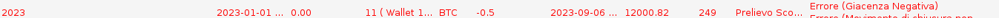

Per correggere la problematica è sufficiente premere il pulsante “**Correggi Errore**” alla fine della Tabella e si verrà reindirizzati alla Funzione “**Giacenze a Data**” nel rigo in cui la giacenza della crypto è diventata negativa, in questo caso è opportuno capirne il motivo e sistemare il movimento o aggiungerne uno in correzione, in caso di piccoli importi è possibile utilizzare il tasto in basso “**Sistema Qta residua**” che creerà un movimento fittizio per far tornare la giacenza del Token perlomeno a Zero.

### Movimento di apertura o chiusura non classificato {#movimento-di-apertura-o-chiusura-non-classificato}

In questo caso si tratta di movimenti di deposito o prelievo non classificati e che il programma quindi non sa come conteggiare correttamente.

Per risolvere premere il pulsante “**Correggi Errore**”, si aprirà una finestra in cui bisognerà indicare che tipo di movimento si sta gestendo.

Questo genere di errori possono essere evitati se si sistema prima il tutto nella funzione “**Classificazione Depositi/Prelievi**”.

### Valore iniziale o finale non valorizzato {#valore-iniziale-o-finale-non-valorizzato}

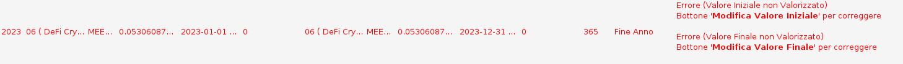

In questo caso l’errore avviene perché il programma non è riuscito a valorizzare il token al momento dell’acquisto/vendita/fine o inizio anno.

Per correggere l’errore premere il bottone “**Modifica Valore Iniziale**” o “**Modifica Valore Finale**” a seconda del caso.

Nel caso in cui il token non abbia prezzo perché ad esempio è SCAM è possibile confermare il prezzo a Zero.

[Torna all'indice della documentazione](./)
